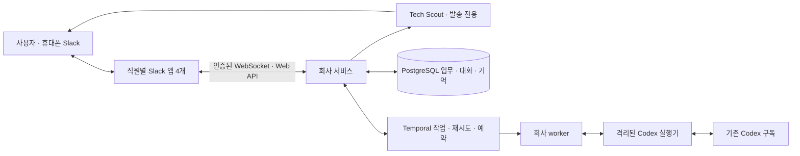

# Quant Company

정본 저장소: [JJongAchii/quant-ai-company](https://github.com/JJongAchii/quant-ai-company) (비공개).
기존 `quant-workspace`에서 코드 이력을 보존해 분리했습니다. [이관 기록](docs/REPOSITORY-MIGRATION.json).

**Slack에서 일하고, 업무·담당자·기억을 서버에 보존하는 퀀트 연구 조직의 첫 서비스입니다.**
사용자의 기존 Codex 구독으로 모델을 실행합니다. AWS 단일 서버와 Temporal Cloud에 배치하는
구성이며, 기본 Slack 연결은 도메인이 필요 없는 Socket Mode입니다.

현재는 **AWS 서울 Lightsail 2GB에 배포한 첫 운영 서비스**입니다. 서버의 공식 Codex 구독 인증,
실제 모델을 사용한 네 직원의 합성 협업, 예약 업무의 호스트 재부팅 복구, S3 백업 복원을 확인했습니다.
실제 사용자의 Slack 요청과 네 직원 계정의 답변 게시도 확인했습니다. 업무 실행·Slack 연결·DB·
Codex 인증은 AWS에 있어 맥북 전원과 무관하게 동작합니다. 장시간 운영 검증은 계속합니다.
[AWS 배포 검증](docs/project/AWS-DEPLOYMENT-VALIDATION.json),
[구현 검증](docs/project/IMPLEMENTATION-VALIDATION.json),
[Slack 연결](docs/project/SLACK-CONNECTION.json),
[Temporal 연결](docs/project/TEMPORAL-CONNECTION.json)에 증거를 구분합니다.
배포 후 운영 정보 전달 보완은 [추가 검증](docs/project/RUNTIME-CONTEXT-VALIDATION.json)에,
현재 업무 범위와 후속 구현 순서는 [다음 단계](docs/project/NEXT-STEPS.md)에 기록합니다.
자연어 지시 변경·공식자료 읽기는 운영에 반영했습니다. 별도 운영자 테스트 스레드에서 실제
구독 모델의 네 직원 협업, 중간 지시 변경, 원문·S3 메타데이터 조회와 최종 Slack 답변을 확인했습니다.
[후속 운영 인수](docs/project/CONVERSATION-FINANCE-VALIDATION.json)에 자동 테스트 입력과
실제 모델·Slack 결과를 구분합니다. 회사의 새 코드·설계·검증 기록은 이 저장소에서만 관리합니다.
데이터 연결은 실제 사용자 Slack 요청으로 확인했습니다. 첫 시도의 출처 ID 누락을 수정하고
같은 스레드에서 재조회·직원 산출물·총괄 답변 게시까지 검증했습니다. 이전 실패 기록은 보존합니다.
범용 웹 검색과 원문 읽기, 개선 BOT의 코드 조사·구현·CI 실패 후 재수정도 운영에 반영했습니다.
운영 서버에서 실제 검색·공식 원문 3건·출처를 포함한 한국어 분석을 확인했습니다.
[웹 검색·개선 BOT 검증](docs/project/WEB-ENGINEERING-VALIDATION.md)에 실제 실행과 fixture 범위를 구분합니다.

`hot-news` 전용 **Reporter**는 연속 수집→원문 확인→주요 뉴스 검토→사건별 게시 경로를 추가했습니다.
기존 서버에서 BBC·CNBC·KBS World·연합뉴스·SBS·이투데이의 무료 언론 피드 19개와 공식 피드 6개를 수집합니다.
기존 구독의 추가 검색, 원문 확인, 매체 귀속과 사건별 후속 처리를 사용하며 추가 유료 API는 없습니다.
[설정·데모와 소스별 확인 상태](docs/news.md), [범위 복원과 실제 검증](docs/project/HOT-NEWS-SCOPE-RESTORATION.md),
[최초 운영 인수·보안 정리](docs/project/HOT-NEWS-ACTIVATION.md)를 참고하세요.
토큰 절약과 KST 06:00~24:00 발송·야간 모음의 설정 및 검증 상태는 [최적화 인수 기록](docs/project/HOT-NEWS-EFFICIENCY.md)에 남깁니다.
**Analyst**의 `daily-brief` 정기 브리핑 구현을 추가했습니다. 한국 시간 07:45와 한국
거래일 17:45에 자료를 종합합니다. 수집 데이터로 계산한 숫자와 뉴스 원문을 연결하며,
핵심 요약·시장 전체 흐름·주요 숫자·최대 여섯 핵심 이슈·다음 확인 사항을 본문에, 상세 근거를 스레드에 제공합니다.
원문별 누락 점검과 내용 깊이 검토를 추가했으며 [실제 출력 평가 기준](docs/project/BRIEFING-CONTENT-EVALUATION.md)을 따릅니다.
새 서버에는 발송 없는 미리보기를 적용했고, 10월 7일부터 새 원문으로 작성·검토와 5거래일 운영 검증을 진행합니다.
자동 발송과 전문가 품질 통과는 [현재 상태](docs/work/amberjack/ANALYST-FINALIZATION-STATUS.json)에서 별도로 확인합니다.
기존 원문을 실제 구독 모델로 작성·검토한 [내용 평가와 읽을 수 있는 결과](docs/project/BRIEFING-CONTENT-RESULTS.md)를 보존합니다.
기본값은 비활성이고 실제 운영 발송과 5거래일 관찰은 아직 검증하지 않았습니다.
[브리핑 설정·복구·데모](docs/briefing.md)를 참고하세요.

AM 최종 발송본을 글 중심 영상으로 제작하고 YouTube에 비공개 업로드한 뒤 Slack에서
공개·수정·보류를 선택하는 선택 경로를 구현했습니다. 기존 Claude 구독 실행기(대본·검토), Runway 웹 계정 음성(Vincent)과
로컬 렌더링을 사용합니다. 기본값은 비활성이고 서버 계정 연결·실제 업로드는 별도로 확인해야 합니다.
[daily video 설정·데모·복구](docs/daily-video.md)를 참고하세요.

`tech-feed`에는 **AI 호출 없이** 국내외 기술 RSS·Atom의 원문 제목·링크·짧은 발췌를 전달하는
별도 구독 기능을 추가했습니다. 12개 소스를 10분 대기 간격으로 수집하고 KST 06~24시에 한 건씩
발송하며, 발송 전용 **Tech Scout** Slack 앱과 기존 DB·Temporal을 사용합니다. Tech Scout는
대화형 직원이나 AI 봇이 아니며 `chat:write`만 갖습니다. 초기 활성화 기본값은 꺼짐입니다.
[설정·데모·복구](docs/tech-feed.md), [검증 및 운영 상태](docs/project/TECH-FEED-VALIDATION.md)를 참고하세요.

`housing-feed`는 서울·경기 청약홈·LH·SH의 공식 분양 공고를 1시간마다 확인하고,
신규·변경 공고와 접수 전날·당일 알림을 Reporter 앱으로 전달합니다.
API 키나 모델 호출은 필요하지 않습니다. [범위·일정·운영](docs/housing-feed.md)을 참고하세요.

## 동작

회사 공용 Codex의 기본·예비 계정을 총괄 DM에서 수동 선택하는 기능을 추가했습니다.
기본값은 비활성화이며 별도 로그인과 운영 활성화가 필요합니다.
[명령·설정·복구](docs/runbooks/model-accounts.md),
[검증 및 운영 반영 상태](docs/project/MODEL-ACCOUNTS-VALIDATION.md)를 참고하세요.



- 총괄이 업무를 나누고, 국내연구 직원이 데이터 직원에게 직접 위임할 수 있습니다.
  내부 업무 전달은 DB에 기록되고 각 직원의 Slack 계정으로 대화가 게시됩니다.
- 총괄의 최종 결과·확인 질문·PR 검토 요청에는 해당 스레드의 요청자를 태그합니다.
  중간 진행·직원 간 대화·접수 안내에는 태그하지 않습니다. [알림 정책](docs/adr/0022-director-owner-mentions.md).
  [운영 검증](docs/project/DIRECTOR-MENTIONS-VALIDATION.json)에서 실제 모델의 중간 보고·최종 답변과 Slack 태그를 확인했습니다.
- 역할별 임무·도구·위임 권한을 검증합니다. 모델은 구조화된 제안을 반환하고 서비스가 적용합니다.
  직원은 내부 저장 안내에 그치지 않고 Slack 답변에 실제 결과를 포함하도록 지시받습니다.
- 프로젝트·업무·대화·출처·산출물·기억을 영속 저장합니다. 검토한 기억만 같은 사용자의 다른
  프로젝트에 공유할 수 있습니다. 제안 단계 기억이 자동으로 사실이 되지 않습니다.
- 같은 요청은 같은 업무로 식별합니다. 구독 한도에 도달하면 업무를 보존하고 기다립니다.
  결과가 불확실한 호출·Slack 발신은 자동으로 새 요청을 만들어 반복하지 않습니다.
- 사용자 업무를 예약 업무보다 먼저 처리하며, 한 번에 모델 작업 1개를 실행합니다.
  회사·개선BOT 일일 호출 제한은 없습니다. 일반 대화의 업무당 8회·위임 깊이 3·프로젝트 모델 업무 40개와 Codex 구독 한도는 유지됩니다.
  승인된 자율 연구 단계는 일반 대화의 8회·40개 한도에서 제외하며, 동결한 연구 명세의 과학 시행 예산을 따릅니다.
  이 한도는 회사의 제어값이며 Codex 구독 제공량을 보장하지 않습니다.

### 직원 구성

| 직원 | 모델 · effort 정책 | 상태 |
|---|---|---|
| 총괄 | gpt-6-astra · max | 활성 역할 |
| 금융전략 | gpt-6-astra · max | 활성 역할 |
| 국내시장 연구 | gpt-6-astra · max | 활성 역할 |
| 데이터 | gpt-5.6-terra · high | 활성 역할 |
| 개발 | gpt-5.6-sol · max | 자율 연구의 승인 범위 구현 담당; 일반 Slack 역할 활성화와 별개 |
| 독립검증 | gpt-6-astra · max | 자율 연구의 독립 감사 담당; 일반 Slack 역할 활성화와 별개 |
| 글로벌연구·가상자산연구·리스크·운영 | [직원 모델 정책](docs/project/STAFF-MODEL-POLICY-20260918.md) | 일반 역할 비활성 |

운영 요청에는 서버의 실제 역할 설정을 보존합니다. 개발·검증의 자율 연구 배치는 아래 기능을
검토 후 활성화해야 시작합니다. 직원별 모델 이름만으로 전문성이나 수익성이 입증되지는 않습니다.

### 지속형 자율 연구 — 첫 프로그램 승인 대기

승인한 상위 목표 안에서 가설 → 독립 반론 → 실행 선택 → 격리 구현 → 3070 실험 → 해석 →
독립 감사·보고 → 다음 가설을 PostgreSQL과 Temporal에 보존합니다. 가설과 핵심 반론은 해당
연구 스레드에 게시하고, 최종 보고·필수 결정에는 요청자를 태그합니다. 새 결과가 나빠도 이번
연구의 최선은 보존하며, 기존 기준선은 별도 출처로 유지합니다.

실제 소유자 Slack 승인을 거친 **고정 P11 재현**은 [인수 완료](docs/project/RESEARCH-OWNER-ACCEPTANCE-20260921.md)했습니다.
자료 기반 연구 서비스는 [운영에 활성화](docs/project/RESEARCH-PROGRAMS-ACTIVATION-20260929.md)했고,
첫 프로그램의 Slack 소유자 승인 요청을 게시했습니다. 프로그램 자체는 아직 `draft`이며 새 과학
실험은 시작하지 않았습니다. [배포·롤백 절차](docs/runbooks/autonomous-research.md)와
[설계 결정](docs/adr/0031-persistent-autonomous-research.md)을 따릅니다.

자료에서 과제를 만드는 **연구 프로그램**도 구현했습니다. 한 번 승인한 범위·예산 안에서
원문 읽기 → 데이터 검토 → 가설·독립 반론 → 실험 → 인과성 감사·별도 해석 → 후속 연구를 연결합니다.
국내 ETF·주식의 전략/주장/재현 평가와 부정적 결과 보존을 지원합니다.
[새 구현의 검증 범위·운영 준비 상태](docs/project/RESEARCH-PROGRAMS-VALIDATION-20260928.md)와
[첫 프로그램 준비안](docs/project/FIRST-RESEARCH-PROGRAM-20260928.md)과
[현재 운영 상태](docs/project/RESEARCH-PROGRAMS-ACTIVATION-20260929.md)를 확인하세요.

모델 배치는 평가 전 초기값입니다. 금융전략에는 거시·채권·주식·회계·파생·리스크·시장구조의
직무, 검증된 출처 검색, 계산 도구, [전문 시험 사례](docs/financial-specialist.md)를 제공합니다.
방대한 지식 기반을 수집했다거나 실제 금융 전문성 시험을 통과했다는 뜻은 아닙니다.

공통 도구는 `calculate`, `knowledge_search`, `read_source`입니다. 활성 직원에게
`finance_search`·`finance_read`를 추가해 [선정된 공식 금융자료](docs/official-sources.md)의 후보 검색과
실제 HTML 원문 읽기를 연결했습니다. 원문·기관·관할·조회 시각을 보존하며, 발행일이 없으면
확인 불가로 남깁니다. 이 브랜치는 별도로 `web_search`·`web_read`를 추가해 외부 검색→원문 수집→
출처를 포함한 분석을 연결합니다. 실제 구독·연준 원문으로 검증했으며 운영 반영 상태는
[웹 조사 검증](docs/project/WEB-ENGINEERING-VALIDATION.md)에 기록합니다. 데이터 담당에는
`lake_catalog`, `lake_describe`, `lake_sample`을 추가했습니다. 기존 EC2가 발행하는 S3 미러를
읽어 데이터 목록·날짜 범위·스키마·최대 20행 샘플을 확인합니다. 조회 결과는 출처·객체 식별자·
조회 시각과 함께 해당 프로젝트에 저장합니다. [데이터 연결 검증](docs/project/DATA-CONNECTION-VALIDATION.json)에
실제 실행 범위와 한계를 기록합니다. 전략 코드 실행, 3070 제출, 세 연구팀의
실제 실험, 실거래 연결은 후속 구현입니다.

현재 확인된 제약: 미국 `us_prices` 파일은 footer 크기 제한으로 기간 조회가 거절되며,
`binance_usdtm_klines`의 관측 시각은 2025-06-30까지였습니다. 데이터가 있다는 이유만으로
최신 자료나 전체 커버리지가 확보됐다고 답하지 않습니다. 전수 누락 검사는 별도 실행 경로가 필요합니다.

각 모델 요청에는 실행 서비스가 로드한 직원별 모델·활성 상태·도구·실행 한도를 함께 전달합니다.
따라서 “각 담당자는 어떤 모델을 쓰니?”, “지금 실제 백테스트도 할 수 있니?” 같은 질문은
검색이나 동료 위임 없이 운영 설정을 근거로 답할 수 있습니다. 이는 요청에 지정한 모델 ID이며
모델 제공자의 내부 배포를 별도로 확인했다는 뜻은 아닙니다. 비밀 값·접속 문자열은 전달하지 않습니다.
이미 준비한 요청의 재시도는 원래 설정을 보존하고, 새 요청부터 현재 설정을 반영합니다.

## Slack에서 사용하는 방식

1. 새 스레드에서 `@quant-director 국내 월간 리밸런싱 아이디어를 검토해줘`라고 요청합니다.
2. 같은 스레드에서 `쉽게 설명해줘`처럼 질문하면 기존 업무를 유지하며 답합니다.
3. `월간으로 바꿔줘`, `채권 ETF부터 우선 정리해줘`처럼 조건을 바꾸면 새 지시 버전으로 진행합니다.
   뜻을 확인하는 동안 이전 결과의 게시를 보류하고, 변경이 확정되면 이전 실행을 무효화합니다.
   `수정:`·`변경:`도 계속 사용할 수 있습니다. 모호한 변경은 확인 질문을 합니다.
4. `중단해`로 해당 스레드의 업무를 멈추고, `이어서 진행해`로 저장된 지시에서 재개합니다.
   `상태`·`진행 상황`과 이 두 명령은 모델 호출 없이 처리하므로 구독 대기 중에도 동작합니다.
   이미 Slack으로 전송 중인 메시지는 뒤늦게 도착할 수 있습니다. 다른 스레드에는 영향을 주지 않습니다.
   구독·프로젝트 실행 한도가 찼을 때도 사용할 수 있습니다.
5. 직원에게 직접 멘션·DM할 수도 있습니다. 처음에는 등록한 본인과 지정 채널만 허용합니다.

데이터 연결 예시: `@quant-director 국내 ETF 데이터는 어떤 기간까지 있고, 최신 거래일은 언제야?
데이터 담당이 실제 조회해서 출처와 함께 알려줘.` 파일 전체의 날짜 범위이며 모든 종목의
기간·결측이 동일하다는 뜻은 아닙니다. S3 업로드 시각과 데이터 날짜도 구분합니다.

이미 Slack에 게시된 과거 버전의 메시지는 기록으로 남습니다. 변경 경쟁 중 네트워크로 이미
전달된 메시지를 소급 취소할 수는 없으므로 발신에는 `[지시 vN]`을 표시합니다.

## 시작할 때

[AWS 설치·복구 안내](docs/deployment.md)와 [Slack 설정](docs/slack-setup.md)을 사용합니다.

`#quant-feeds` 전용 Quant Scout의 원문 심사·별도 근거 검사·발송 운영은
[퀀트 연구 피드 안내](docs/quant-feed.md)를 참고하세요. 기본 비활성이며, 뉴스와 별도 슬롯을 사용합니다.
기존 EC2·Insight-Invest가 있는 `default` 프로필의 서울 리전에서 별도 Lightsail **2GB·월 $12**를
생성을 승인받아 운영합니다. 약 4분간의 합성 협업 측정에서 호스트 가용 메모리는 최소 1072.5 MiB였고,
메모리 부족으로 종료된 컨테이너는 없었습니다. 이는 동시 모델 작업 1개의 짧은 검사이며 장시간 부하
보장은 아닙니다. 기존 4GB 설정은 비교 기준으로 남아 있습니다.

```bash
uv sync --frozen
uv run quant-company slack-manifests --output .local/slack-manifests
```

명령은 앱 설정 파일만 생성합니다. 앱 설치·메시지 발신·AWS 구매를 실행하지 않습니다.
[이미 생성한 네 앱 설정](slack-apps/)도 사용할 수 있습니다.

## 개발과 검증

Python 3.11+가 필요합니다. 통합 검사는 **임시 DB를 생성·삭제할 수 있는 전용 PostgreSQL**의
접속 문자열을 `TEST_DATABASE_URL`로 받습니다. 실제 사용자 데이터를 가진 DB를 지정하지 마세요.
Temporal 검사는 로컬 개발 서버를 띄워 실행하고 종료합니다.

```bash
uv sync --frozen
uv run ruff check .
TEST_DATABASE_URL=postgresql://test_user@localhost:5432/postgres \
  uv run pytest -q tests deploy/test_deployment_contract.py evals/test_financial_fixtures.py
```

DB가 없으면 해당 통합 검사는 건너뜁니다. `CODEX_CONFIG_PROBE=1`은 실제 설치된 CLI의 설정만
검사하고 추론하지 않습니다. 기본 검사에서 실제 모델·Slack·AWS 호출은 발생하지 않습니다.

실제 구독 검사는 명시적으로 실행합니다. `CODEX_HOME`은 공식 ChatGPT 로그인이 된 전용
디렉터리여야 하며 API 키로 전환하지 않습니다.

```bash
uv run python scripts/smoke_codex.py --request-id unique-connection-check
REAL_CODEX_COMPANY=1 uv run pytest -q tests/test_temporal.py::test_live_codex_company_producer_consumer
```

두 번째 검사는 합성 자료·실제 PostgreSQL·로컬 Temporal·실제 Codex를 사용합니다. 최대 12회,
모든 역할에 작은 공통 모델을 적용하는 통신 검사이며 금융 전문성 평가는 아닙니다.
결과는 `.local/live-company.json`, 호출 영수증은 `.local/live-company-jobs/`에 남습니다.

## 운영과 복구

- 필수 실행 프로세스: `serve`, `worker`, `dispatch`, `slack-socket`, 별도 Codex runtime.
  운영에서는 [Compose](deploy/compose.yaml)가 프로세스와 볼륨을 관리합니다.
- 운영 API는 localhost와 별도 bearer token으로 제한합니다. 모델 컨테이너에는
  DB·Slack·AWS 비밀이나 Docker socket을 제공하지 않습니다.
- `/v1/tasks/{id}/retry`는 운영자가 이전 영수증을 확인한 `reconciliation_note`가 필요합니다.
  재시도는 새 호출이므로 구독 사용량을 다시 소비할 수 있습니다. 이전 기록은 보존합니다.
- DB와 Codex 영수증을 함께 백업합니다. 복원 스크립트는 새 `restore_*` DB만 만들고 기존 DB를
  덮어쓰지 않습니다. 실제 S3에서 내려받아 두 프로젝트·업무·대화·산출물이 같은지 확인했습니다.
  일일 백업 timer는 한국 시간 03:10에 시작하며 최대 5분 지연됩니다.
- 단일 서버는 장애 시 복구 중단이 있습니다. 맥북 종료 후 동작하는 실제 인수는 클라우드 연결
  후 수행합니다. 구독 한도나 프로세스 health만으로 서비스 가용성을 보장하지 않습니다.

코드 경계는 [INTERFACES](INTERFACES.md), 모델 실행은 [Codex runtime](docs/codex-runtime.md),
전체 조직 확장은 [설계·인수 명세](docs/project/BUILD-AND-ACCEPTANCE.md)를 참고하세요.

## 개선 BOT — 운영 중

회사에 저장된 대화·오류와 최근 30일의 업무·위임 기록을 살펴보고, BOT 행동·협업·조직의 개선
가설을 만듭니다. 코드 수정은 회귀 검증, 직원 지침 수정은 고정된 문제/정상 요청의 전후 비교를 거쳐
draft PR로 제안합니다. 이번 개선은 명시적인 기능 구현 요청에 대해 코드·외부 문서를 추가 조사하고,
새 모듈과 도구 연결을 구현하며 CI 실패를 근거로 최대 3개 후보를 수정하는 경로를 추가합니다.
구체적인 미결정 사항이 구현을 막을 때 설계 PR을 사용합니다.
기존 구독 실행기를 쓰고 사용자 업무·회사 공통 예산 안에서 처리합니다.
CI를 통과한 PR은 원래 Slack 스레드에 총괄 계정의 `[개선 담당]` 알림으로 연결합니다.

기존 AWS 서버에서 실행 중이며, 실제 문서 PR 생성과 Slack 승인 후 병합·완료 알림을 확인했습니다.
PR 알림 스레드에서 소유자가 `반영해`라고 승인하면 해당 커밋을 검사해 병합하고, 실행 코드 변경이면
서버 배포를 이어갑니다. 총괄에게 개선 진단을 요청하거나 보관 이력·진행 상태를 조회할 수 있습니다.
범위와 검증 한계는 [개선 BOT 운영](docs/maintenance.md)을 보세요.

정기 시황 브리핑은 Analyst의 구현과 실제 모델 내용 평가를 진행했으며 운영 발송 인수가 남아 있습니다.
요청형 시장 분석 BOT은 [후속 로드맵](docs/project/NEXT-STEPS.md)의 별도 미구현 항목입니다.

# 채널 구조와 전용 개선 담당

[회사 Slack 최종 구조](docs/project/SLACK-COMPANY-DESIGN.md)와
[Maintainer 사용·설치 절차](docs/improvements.md)를 따른다. 전용 개선 채널은 기본 비활성이며,
실제 운영 적용 여부는 [인수 기록](docs/project/IMPROVEMENTS-VALIDATION.md)에 따로 표시한다.

두 번째 구현인 [data-watch](docs/data-watch.md)는 전체 레이크의 제한된 메타데이터와
승인된 ETF 고정 입력 검사를 구분해 기록한다. 기존 데이터 직원이 일일 요약·장애·복구를
알리며 상태 조회와 예약에는 모델을 호출하지 않는다. 기본 비활성이고,
[검증 기록](docs/project/DATA-WATCH-VALIDATION.md)은 실제 Slack·3070 운영 활성화와 구별한다.
