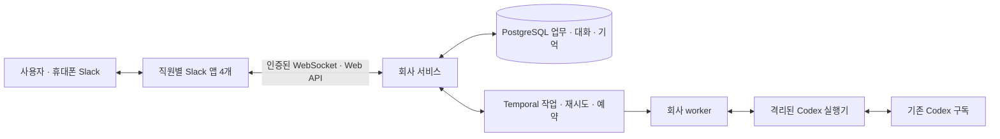

# Quant Company

**Slack에서 일하고, 업무·담당자·기억을 서버에 보존하는 퀀트 연구 조직의 첫 서비스입니다.**
사용자의 기존 Codex 구독으로 모델을 실행합니다. AWS 단일 서버와 Temporal Cloud에 배치하는
구성이며, 기본 Slack 연결은 도메인이 필요 없는 Socket Mode입니다.

현재는 **로컬 구현·검증 및 배포 준비 단계**입니다. AWS 상시 서비스와 실제 Slack 앱은
아직 연결하지 않았습니다. 수행한 검사와 미실행 인수는
[검증 기록](../../docs/work/quant-ai-company/IMPLEMENTATION-VALIDATION.json)에서 구분합니다.

## 동작



- 총괄이 업무를 나누고, 국내연구 직원이 데이터 직원에게 직접 위임할 수 있습니다.
  내부 업무 전달은 DB에 기록되고 각 직원의 Slack 계정으로 대화가 게시됩니다.
- 역할별 임무·도구·위임 권한을 검증합니다. 모델은 구조화된 제안을 반환하고 서비스가 적용합니다.
- 프로젝트·업무·대화·출처·산출물·기억을 영속 저장합니다. 검토한 기억만 같은 사용자의 다른
  프로젝트에 공유할 수 있습니다. 제안 단계 기억이 자동으로 사실이 되지 않습니다.
- 같은 요청은 같은 업무로 식별합니다. 구독 한도에 도달하면 업무를 보존하고 기다립니다.
  결과가 불확실한 호출·Slack 발신은 자동으로 새 요청을 만들어 반복하지 않습니다.
- 사용자 업무를 예약 업무보다 먼저 처리하며, 한 번에 모델 작업 1개를 실행합니다.
  시작 한도는 하루 100회·업무당 8회·위임 깊이 3·프로젝트 모델 업무 40개입니다.
  이 한도는 회사의 제어값이며 Codex 구독 제공량을 보장하지 않습니다.

### 직원 구성

| 직원 | 첫 모델 배치 | 상태 |
|---|---|---|
| 총괄 | gpt-6-astra | 활성 역할 |
| 금융전략 | gpt-6-astra | 활성 역할 |
| 국내시장 연구 | gpt-5.6-sol | 활성 역할 |
| 데이터 | gpt-5.6-terra | 활성 역할 |
| 글로벌연구·가상자산연구·개발·독립검증·리스크·운영 | 역할별 설정 | 정의만 준비, 비활성 |

모델 배치는 평가 전 초기값입니다. 금융전략에는 거시·채권·주식·회계·파생·리스크·시장구조의
직무, 검증된 출처 검색, 계산 도구, [전문 시험 사례](docs/financial-specialist.md)를 제공합니다.
방대한 지식 기반을 수집했다거나 실제 금융 전문성 시험을 통과했다는 뜻은 아닙니다.

현재 도구는 `calculate`, `knowledge_search`, `read_source`입니다. 출처 저장소에 등록된 자료를
읽으며, 인터넷이나 전체 연구 레이크를 자동 검색하지 않습니다. 현재 산출물은 검토·연구 계획과
문서입니다. 전략 코드 실행, 3070 제출, 세 연구팀의 실제 실험, 실거래 연결은 후속 구현입니다.

## Slack에서 사용하는 방식

1. 새 스레드에서 `@총괄 국내 월간 리밸런싱 아이디어를 검토해줘`라고 요청합니다.
2. 같은 스레드의 일반 질문은 추가 업무로 들어갑니다.
3. `수정: 이번에는 ETF만 대상으로 해줘` 또는 `변경:`은 지시 버전을 올립니다.
   이전 실행 결과의 신규 반영을 막고 진행 중 모델 호출에 취소를 전달합니다.
4. `상태` 또는 `진행 상황`은 모델 호출 없이 저장된 업무 현황을 보여줍니다.
   구독·프로젝트 실행 한도가 찼을 때도 사용할 수 있습니다.
5. 직원에게 직접 멘션·DM할 수도 있습니다. 처음에는 등록한 본인과 지정 채널만 허용합니다.

이미 Slack에 게시된 과거 버전의 메시지는 기록으로 남습니다. 변경 경쟁 중 네트워크로 이미
전달된 메시지를 소급 취소할 수는 없으므로 발신에는 `[지시 vN]`을 표시합니다.

## 시작할 때

[AWS 설치·복구 안내](docs/deployment.md)와 [Slack 설정](docs/slack-setup.md)을 사용합니다.
기존 EC2·Insight-Invest가 있는 `default` 프로필의 서울 리전에서 별도 Lightsail 4GB를
준비하는 안입니다. 기존 데이터 수집 EC2의 일정·수명주기는 유지합니다.

```bash
uv sync --frozen
uv run quant-company slack-manifests --output .local/slack-manifests
```

명령은 앱 설정 파일만 생성합니다. 앱 설치·메시지 발신·AWS 구매를 실행하지 않습니다.
[이미 생성한 네 앱 설정](slack-apps/)도 사용할 수 있습니다.

## 개발과 검증

Python 3.11+가 필요합니다. 통합 검사는 **임시 DB를 생성·삭제할 수 있는 전용 PostgreSQL**의
접속 문자열을 `TEST_DATABASE_URL`로 받습니다. 실제 사용자 데이터를 가진 DB를 지정하지 마세요.
Temporal 검사는 로컬 개발 서버를 띄워 실행하고 종료합니다.

```bash
uv sync --frozen
uv run ruff check .
TEST_DATABASE_URL=postgresql://test_user@localhost:5432/postgres \
  uv run pytest -q tests deploy/test_deployment_contract.py evals/test_financial_fixtures.py
```

DB가 없으면 해당 통합 검사는 건너뜁니다. `CODEX_CONFIG_PROBE=1`은 실제 설치된 CLI의 설정만
검사하고 추론하지 않습니다. 기본 검사에서 실제 모델·Slack·AWS 호출은 발생하지 않습니다.

실제 구독 검사는 명시적으로 실행합니다. `CODEX_HOME`은 공식 ChatGPT 로그인이 된 전용
디렉터리여야 하며 API 키로 전환하지 않습니다.

```bash
uv run python scripts/smoke_codex.py --request-id unique-connection-check
REAL_CODEX_COMPANY=1 uv run pytest -q tests/test_temporal.py::test_live_codex_company_producer_consumer
```

두 번째 검사는 합성 자료·실제 PostgreSQL·로컬 Temporal·실제 Codex를 사용합니다. 최대 12회,
모든 역할에 작은 공통 모델을 적용하는 통신 검사이며 금융 전문성 평가는 아닙니다.
결과는 `.local/live-company.json`, 호출 영수증은 `.local/live-company-jobs/`에 남습니다.

## 운영과 복구

- 필수 실행 프로세스: `serve`, `worker`, `dispatch`, `slack-socket`, 별도 Codex runtime.
  운영에서는 [Compose](deploy/compose.yaml)가 프로세스와 볼륨을 관리합니다.
- 운영 API는 localhost와 별도 bearer token으로 제한합니다. 모델 컨테이너에는
  DB·Slack·AWS 비밀이나 Docker socket을 제공하지 않습니다.
- `/v1/tasks/{id}/retry`는 운영자가 이전 영수증을 확인한 `reconciliation_note`가 필요합니다.
  재시도는 새 호출이므로 구독 사용량을 다시 소비할 수 있습니다. 이전 기록은 보존합니다.
- DB와 Codex 영수증을 함께 백업합니다. 복원 스크립트는 새 `restore_*` DB만 만들고 기존 DB를
  덮어쓰지 않습니다. 실제 S3 복원·호스트 재부팅 인수는 배포 환경에서 이어서 확인해야 합니다.
- 단일 서버는 장애 시 복구 중단이 있습니다. 맥북 종료 후 동작하는 실제 인수는 클라우드 연결
  후 수행합니다. 구독 한도나 프로세스 health만으로 서비스 가용성을 보장하지 않습니다.

코드 경계는 [INTERFACES](INTERFACES.md), 모델 실행은 [Codex runtime](docs/codex-runtime.md),
전체 조직 확장은 [설계·인수 명세](../../docs/work/quant-ai-company/BUILD-AND-ACCEPTANCE.md)를 참고하세요.
