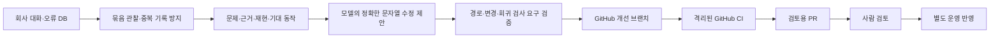

# ADR-0013: 대화 기반 개선 BOT과 검토 후 운영 반영

상태: 사용자 정책 확정, 구현 검토 중. 2026-09-16.

사용자 선택: **“수정·테스트·PR까지 자동, 운영 반영은 검토 후 진행”**.

## 결정

회사 DB에 이미 수집한 허용 사용자·프로젝트의 대화와 `turn_blocked` 이벤트를 관찰한다.
Slack의 다른 채널·DM을 새로 읽는 권한은 추가하지 않는다. 한 프로젝트의 요구를 전역 설정으로
취급하지 않는다. 초기판은 재현할 수 있는 플랫폼 결함에 집중하며, 근거가 부족하거나 보호된
범위이면 수정하지 않고 triage 사유 또는 blocked 기록을 남긴다.

모델은 기존 격리된 Codex 실행기를 사용해 구조화된 제안만 반환한다. Git broker가 검증 후
Git 객체·고유 브랜치·draft PR을 만든다. 모델에게 GitHub key, DB/Slack/AWS 자격증명이나
Docker socket을 주지 않는다. 후보 코드는 운영 서버에서 실행하지 않는다. CI는 운영 비밀과
쓰기 토큰 없이 실행한다. 권한·CI·배포·개선 BOT 자신·기존 테스트 파일은 자동 변경 대상에서
제외한다. 일반 런타임 코드의 의미상 권한 영향까지 경로 검사로 보장하지는 않으므로 PR 검토가
필요하다. Python 수정은 새 회귀 검사를 요구하며 기존 검사를 바꿔 통과시키지 않는다.
CI에서 새 회귀 검사를 수정 전 parent 코드에 먼저 실행해 assertion 실패가 재현되는지 확인한 뒤,
수정된 전체 코드의 검사를 통과시킨다. import 오류·미수집·skip은 문제 재현으로 인정하지 않는다.

## 영속성과 예산

- PostgreSQL에 observation/job/call/receipt를 추가 저장하고 Temporal이 예약·실행을 담당한다.
- 관찰 ID의 처리 여부로 읽는다. 타임스탬프 cursor 뒤에 늦게 commit된 행도 놓치지 않는다.
- 동시 실행은 DB advisory lock으로 1개다. 재시작 시 같은 모델 request ID와 원래 입력을 쓴다.
- 같은 `problem_key`는 같은 case가 된다. 이 key는 모델 분류이므로 의미상 중복 제거의 완전성을
  보장하지 않는다. 반복 근거는 triage 영수증에 같은 case로 연결한다. 종료된 건을 자동 재개하지 않는다.
- 추가 한도 하루 모델 6회, 회사 공통 하루 100회 안에서 예약한다. 사용자 업무가 먼저다.
  기본 관찰 10분·작업 진행 5분 간격이며 새 상시 LLM 세션을 계속 가동하는 방식이 아니다.
- 고유 브랜치와 고정 날짜의 content-addressed commit으로 Git 재시도를 대조한다. 다른 HEAD를
  덮어쓰지 않는다. PR 생성 응답이 불확실하면 자동 반복하지 않고 운영자 확인 대상으로 남긴다.
- CI의 정확한 HEAD·workflow·실행 attempt·테스트 step 성공을 확인하고 PR 직전 다시 대조한다.
  실패하면 blocked로 보존한다. 자동 무한 재수정·재시험은 없다.
- 최초 Slack 알림은 총괄 계정에서 `[개선 담당]`으로 명시한다. 같은 PR 알림은 한 번만 outbox에
  넣고 관찰에서 제외한다. 별도 직원 Slack 앱을 이미 설치했다는 의미는 아니다.

## 권한과 운영

GitHub App은 이 저장소만 대상으로 설치하며 Contents write, Pull requests write,
Actions read를 요청한다. Workflows write·Administration·Actions write는 요청하지 않는다.
이 권한만으로 main 변경/merge를 GitHub가 금지한다고 주장하지 않는다. broker에는 merge·deploy·
ref update 경로가 없다. 2026-09-16 실제 private main protection 조회는 403을 반환하며
GitHub Pro 업그레이드가 필요하다고 안내했다. 유료 업그레이드나 공개 전환은 하지 않았다.
따라서 현재 사람 검토 정책은 이 broker/배포 경로로 집행하며 GitHub 자체의 강제 보호라고
보고하지 않는다.
공식 근거: [App 권한](https://docs.github.com/en/apps/creating-github-apps/registering-a-github-app/choosing-permissions-for-a-github-app),
[보호 브랜치](https://docs.github.com/en/repositories/configuring-branches-and-merges-in-your-repository/managing-protected-branches/about-protected-branches).

초기 구현은 기본 비활성 profile이다. 검토할 PR, 실제 App 설치, 상시 서버의 추가 메모리 실측을
확인한 뒤 운영에 반영한다. 현재 추가 구매·자동 merge·자동 배포는 없다.

이 과정은 제품 코드·역할 설명·도구의 개선이다. 기반 LLM의 가중치를 학습하는 기능이 아니다.
