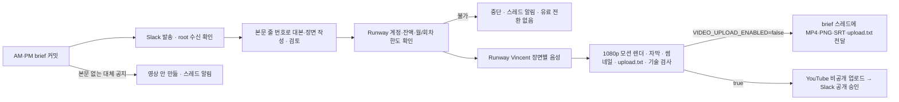

# Daily brief 영상 자동화

뭐든story의 시장 브리핑 영상은 **Slack에 발송된 브리핑 본문**(daily-brief edition의 rendered 본문)만으로 만든다.
기사 원문·수집 묶음·초안은 대본 작성기와 검사기에 전달하지 않는다. AM·PM 회차가 커밋·발송되면 서버의 video worker가
대본·장면·모션 렌더·Vincent 내레이션·단어 단위 자막·썸네일·업로드 문안을 만들고, 기본 설정에서는 **완성 파일을
그 회차 brief 스레드로 전달**한다. 소유자가 전체 시청 후 YouTube에 직접 올린다. YouTube API 업로드는 구현돼 있지만
`VIDEO_UPLOAD_ENABLED=false`(기본)로 꺼져 있다(Google OAuth 앱이 Testing·미검증 상태라 업로드가 비공개로 잠긴다).
[daily video 제작 기준](DAILY_VIDEO_PRODUCTION_STANDARD.md)과 [디자인 명세](DAILY_BRIEF_DESIGN_SPEC.md)를 따른다.



## 구현과 현재 운영의 경계

이 경로는 구현했고 기본값은 꺼짐이다(`VIDEO_ENABLED=false`). 운영 서버에 배포·활성화한 증거는 아직 없다.
`briefing_publish_enabled=true`인 실제 발송 회차(AM·PM)가 DB에 커밋되는 같은 트랜잭션에서 영상 작업을 만든다.

| 발송본 (`brief_editions.quality`) | 영상 |
| --- | --- |
| `fallback`이 비어 있는 본문(전체·`일부 확인 중` 축소 포함) | 만든다 (일반 회차, 9~16장면) |
| `fallback`이 있어도 `original_facts`가 있는 본문(분석 대신 수집 사실 목록, briefing PR #132 'always body') | 만든다. `issue_count=0`이면 짧은 회차: `cold_open` → `market_board` → 사실 장면 2~4개 → `calendar` → `signals` |
| `fallback`이 있고 `original_facts`도 없는 공지(수집된 것이 없음) | 만들지 않는다. `video_skips`에 기록하고 root 발송 확인 뒤 스레드에 한 번 알린다 |
| 미리보기·미검토 초안·만료 이후 | 만들지 않는다 |

작업은 brief root 메시지의 Slack 수신(`outbox.status=delivered`, `sent_ts`)이 확인된 뒤에만 시작한다. 그 전에는 모델·음성 비용을
쓰지 않는다. 대본 원천은 본문을 줄 단위로 번호(`b001`…) 매긴 목록이며(`video/body.py`), 장면은 줄 ID를 인용하고 화면·자막·
내레이션·티커·제목·썸네일의 모든 숫자가 인용한 줄 안에 있어야 한다. 본문 출처 목록에서 매체 1곳만 인용한 보도 문장은
그 장면에서 "보도에 따르면"을 말해야 하고, `정규장 종가` 값을 화면에 쓰면 "정규장 종가 기준", 순매수·순매도 수급을 쓰면
"장 마감 기준"을 화면에 표시해야 한다. 화면·내레이션·제목·설명·태그에 제작 도구 문구(AI 분석·Analyst·Claude·Runway 등)는
검사기가 거부한다. 회차 구성은 이번 주 손으로 만든 회차(13장면, 4~5분)와 같은 틀로 9~16장면, `cold_open` → `summary3` →
`market_board` → 핵심 이슈 → 함께 볼 이슈 → `calendar` → `signals`다. 제목 규칙(시리즈 이름은 끝, 앞 20자 숫자·종목, 급락 기준)은
[디자인 명세 §15](DAILY_BRIEF_DESIGN_SPEC.md)를 따른다. 썸네일·장면 이미지는 회차별로 기록하고(`video_asset_usage`)
최근 7일 안에 쓴 이미지는 대본 단계에 제시하지 않는다(그 태그의 모든 이미지가 최근이면 가장 오래전에 쓴 한 장만).

일정은 브리핑 일정(`briefing/schedule.py`)을 그대로 따르므로 휴장일 처리도 같다. 브리핑이 만들어지지 않는 날은
영상도 만들지 않는다.

| 회차 | 원문 발송 | 영상 준비 목표 | 제작 중단(만료) |
| --- | --- | --- | --- |
| 아침 | 07:45 KST(미국 마감 조기 발송 시 더 이르게) | 08:30 KST | 09:00 KST |
| 마감 | KRX 거래일 15:50 수집 시작 · 16:10 기준 · 17:25 마감(`BRIEFING_KR_CLOSE_ENABLED`, 준비되면 조기 발송) | max(19:30, 마감+1시간 45분) | 목표+2시간 30분 (기본 22:00 KST) |

목표 시각까지 영상이 없으면 한 번 상태를 알리고, 만료 뒤에는 새 생성(모델·음성 비용)을 중단한다. 이미 렌더한 파일의
Slack 전달은 만료와 관계없이 진행한다.
공개 요청 직전에도 마감과 계정·파일을 확인한다. 목표 시간의 실제 달성은 서버 사양과 실제 음성으로 관찰해야 한다.

## 비용과 계정

대본 작성(`video_plan_v1`)과 별도 검토(`video_review_v1`)는 서버의 기존 Claude 구독 실행기
([Claude runtime](claude-runtime.md), Pro/Max 공식 로그인, `claude-opus-5`)에서 실행한다. Codex runtime으로
자동 전환하지 않으며 Codex는 영상 계약을 받지 않는다. 실행기는 요청 계약에 맞는 JSON schema만
`--json-schema`로 전달하고 도구·MCP·세션 저장 없이 한 번 실행한다. 직원 독립 검토와 같은 단일 실행 lane과
구독 한도를 공유한다. lane 사용 중(`busy`)이나 구독 한도 소진(`quota`)은 실행 전 거절이므로 호출 예약을
반환하고 같은 요청 ID로 나중에 재시도한다. 회사 일일 호출 제한 집계는 그대로 적용한다.
검색·앱·MCP·셸 도구와 media credentials는 모델에 전달하지 않는다. Claude 계정의 usage credits/extra
usage가 꺼져 있어야 하며(`CLAUDE_USAGE_CREDITS_DISABLED_CONFIRMED=true`) 결제 API 키로 전환하지 않는다.
Runway 음성은 OAuth로 `https://mcp.runwayml.com/mcp`에 연결한다.
[공식 Runway 안내](https://help.runwayml.com/hc/en-us/articles/51931843164691-Connecting-to-Runway-MCP)에
따르면 이 MCP는 웹 계정 크레딧을 사용한다. `dev.runwayml.com/mcp`와 직접 유료 API로 전환하지 않는다.
기존 ChatGPT 앱 연결 토큰이 서버로 자동 이관되지는 않으므로 서버에서 처음 한 번 로그인한다.

음성 모델은 `eleven_multilingual_v2`, 기본 voice는 Runway preset `Vincent`다. 이번 주 손 제작본은 Runway 웹에서 ElevenLabs
Eleven v4를 골랐지만, 이 코드가 쓰는 MCP `generate_speech`에서 v4 모델 ID를 고를 수 있는지는 확인하지 못했다. 그래서
모델 값은 바꾸지 않았다(첫 서버 샘플에서 `tools/list` 스키마로 확인 후 별도 변경). 현재 확인한 MCP 조건인
문자 50개당 1 credit을 **장면별 올림**으로 예약한다. 실제 한국어 발음·서비스 조건은 첫 비공개
샘플에서 다시 확인한다. 예를 들어 한 회 3,000자는 최소 약 60 credits이고,
26회면 약 1,560 credits라서 기본 월 제한 1,500을 넘길 수 있다. 수정본도 같은 회차 한도에 합산한다.
기존 다른 영상이 같은 계정 잔액을 쓰므로 생성 직전 잔액과 workspace를 확인한다.
월 한도는 아침·마감 두 회차를 합친 값이다. 회차 한도는 회차(edition)마다 따로 센다. 장면을 내기 전에 남은 장면 전체의
예상 크레딧을 먼저 검사해, 한도를 넘으면 첫 요청도 보내지 않고 작업을 `blocked`(Insufficient narration budget)로 멈춘다.
예상치는 장면(음성 1회 생성)마다 시작한 500자당 1 credit이고, 다시 만들 몫으로 남은 장면 수의 20%를 더해 검사한다.
2026-10-07 Runway 웹(ElevenLabs Eleven v4)에서는 55~210자 장면 20회 생성에 1회당 1 credit이 차감됐다. 19장면 회차면
예상 19+4=23 credits, 하루 두 편·한 달 약 60편이면 약 1,400 credits라 기본 월 한도 1,500 안에 든다. 한도 검사 자체(월 1,500·회차 100)는 그대로다.
13장면 회차(4~5분, 장면당 500자 미만)는 13+3=16 credits로 검사하고 실제 약 13~17 credits를 쓴다.
잔액이 부족하면 `runway_balance`, 월/회차 한도면 `credit_cap`, Runway 연결·로그인 실패면 `runway_unavailable`로 첫 음성 요청 전에
멈추고 brief 스레드에 사유·이번 회차/월 사용량을 한 번 알린다. 구매·충전 도구와 자동 유료 API fallback은 없다.
원화 5만원은 추가 지출 목표이며, 서버 증설과 별도 구독 구매는 이 코드가 실행하지 않는다.

화면은 [아침 시장 브리핑 디자인 명세](DAILY_BRIEF_DESIGN_SPEC.md)의 고정 틀(`VIDEO_TEMPLATE=motion-v2`, 기본값)로 만든다.
Claude는 `video_episode_v1` 계약으로 정해진 카드 종류와 필드만 채운다(`video/episode.py`). 화면 배치·색·모션은
패키지에 포함된 템플릿(`video/design/`, Pretendard OFL 글꼴 포함)이 정한다. 검사기는 화면·티커·자막·내레이션의
모든 숫자가 해당 장면이 인용한 동결 원문 주장 안에 있는지(부호는 ▲▼로 표시하므로 절댓값 비교), 카드 종류·아이콘·
지도 지역·이미지 ID가 허용 목록 안에 있는지 확인한다. `motion.py`는 실제 음성 단어 타임스탬프로 자막을 맞추고,
장면 최종 상태에서 글자 겹침·카드 넘침·빈 공간·자막 3줄을 DOM으로 검사한 뒤 `seek(t)`로 30fps 프레임을 찍어
FFmpeg로 합성한다. 검사 실패, true peak -1.5 dBTP 초과, 검은 화면·긴 무음이면 결과를 만들지 않는다.
이 템플릿 이전에 만든 작업은 정책에 기록된 `text-v1`로 그대로 렌더한다.

이미지는 서버에서 매일 찾지 않는다. 사람이 검수한 라이브러리(`${STATE_DIR}/video-assets`, 읽기 전용 mount)의
`manifest.json`에 있는 ID만 쓸 수 있다. 자료사진은 CC0·퍼블릭 도메인·CC BY만 쓰고 화면 칩(자료사진 · 저작자 ·
라이선스)과 업로드 설명란 출처를 렌더러가 manifest에서 자동으로 만든다. 일러스트는 Codex 구독으로 만든 비사진풍
그림이며 "일러스트" 칩을 단다. 라이브러리 원본은 iCloud `뭐든story/아침브리핑/library/`(images·photos·manifest.json)에
있고 서버 반영은 사람이 복사한다. 음악은 출처가 정해질 때까지 넣지 않는다.
렌더링 시도마다 별도 디렉터리를 쓰므로 중단된 렌더가 승인한 파일을 덮어쓰지 않는다.
DB와 media-auth는 기존 복구 정책에 포함하고, 업로드 영상·manifest·영수증을 함께 백업한다.
렌더와 검사가 끝나면 중간 파일(프레임 조각, 무음 영상, 음성 WAV, 화면 폴더, 회차당 약 0.2GB)을 바로 지운다.
최종 MP4·자막·문안·manifest는 작업이 끝난(공개·만료·보류·대체·차단) 뒤 `VIDEO_RETENTION_DAYS`(기본 14일)가 지나면 지운다.
DB의 계획·영수증·파일 해시는 남는다. 영상 볼륨 여유가 `VIDEO_MIN_FREE_GB`(기본 10GB)보다 적으면 대기 중인 회차를
시작하지 않고 `blocked`(insufficient_disk)로 두며 brief 스레드에 한 번 알린다. 크레딧은 쓰지 않는다.
고정 댓글 문안은 업로드 패키지에 제공하며 댓글 자동 게시·고정은 이 버전에 포함하지 않았다.

## 서버 준비

`deploy/video.compose.yaml`은 선택 프로필이다. media worker만 OAuth 파일·영상 파일에 접근하고,
Slack 토큰은 기존 API/socket/dispatcher에만 있다.
[영상 설정 예제](../deploy/video.env.example)는 기존 private runtime.env에 필요한 값만 추가할 때 사용한다.
DB와 Temporal을 기존 서비스와 공유하며
media worker의 작업 큐는 `${TEMPORAL_TASK_QUEUE}-video`다. 모든 프로세스가 같은 버전의
코드·영상 플래그·brief owner/channel 설정을 사용해야 한다.

먼저 기존 app 이미지를 만들고 video 이미지를 만든다. 아래 명령은 템플릿이며 운영 서버에서
실행한 증거가 아니다. 기존 설치의 추가 overlay와 release 고정값을 유지한다.

```sh
docker compose -f deploy/compose.yaml build api
docker compose -f deploy/compose.yaml -f deploy/video.compose.yaml --profile video --profile claude build video-worker
```

video worker는 `claude-runtime`이 healthy일 때 시작한다. 항상 `--profile video --profile claude`를 함께 쓴다.
Claude 실행기 로그인과 usage credits 확인은 [Claude runtime 최초 연결](claude-runtime.md)을 따른다.
영상만 켤 때 `COMPANY_STAFF_REVIEW_ENABLED`를 켤 필요는 없다.

호스트의 `${STATE_DIR}/video`, `media-auth`, `video-models`, `video-assets`를 uid/gid 10001 소유로 먼저 만든다.
`media-auth`는 0700, 토큰/YouTube client 파일은 0600이다. 파일을 Git에 넣지 않는다.
video 이미지에 Chromium, FFmpeg, 한국어 Noto 폰트와 영상 optional dependencies가 들어 있다.
Whisper small은 `/state/models`에 캐시한다. 첫 다운로드와 최초 렌더링을 미리 끝낸다.
기본 worker 한도는 1.5 CPU/1536MiB다. 2GB 서버에는 켜지 않는다. 8GB(권장)·4GB 메모리 설정은
[8GB 예시](../deploy/lightsail-8gb.env.example)·[4GB 예시](../deploy/lightsail-4gb.env.example), 서버 이전은
[서버 요금제 변경 안내](server-migration.md)를 따른다. 렌더 속도는 `quant-company video bench`로 잰다. 추가 서버 구매·사양 변경을 자동으로 수행하지 않는다.

Google Cloud에서 해당 채널용 YouTube Data API v3와 Desktop OAuth client를 준비하고,
`media-auth/youtube-client.json`에 둔다. OAuth scope는 업로드와 `youtube.force-ssl`이다.
OAuth testing 상태의 refresh token 만료와 브랜드 계정 선택을 확인한다.
[YouTube 공식 문서](https://developers.google.com/youtube/v3/docs/videos/insert)는 미검증 API 프로젝트의
업로드가 비공개로 제한될 수 있다고 명시한다. 공개 기능은 필요한 심사와 채널 권한 확인 뒤 켠다.

로컬 또는 서버의 SSH 터널을 통해 로그인한다.

```sh
# 노트북에서: 로그인 동안만 유지
ssh -L 8766:127.0.0.1:8766 -L 8767:127.0.0.1:8767 SERVER
# 서버의 video worker가 실행된 뒤: container listener, 호스트 포트는 loopback에만 노출
docker compose -f deploy/compose.yaml -f deploy/video.compose.yaml exec video-worker \
  quant-company video-auth runway --listen-host 0.0.0.0
docker compose -f deploy/compose.yaml -f deploy/video.compose.yaml exec video-worker \
  quant-company video-auth youtube --listen-host 0.0.0.0
```

처음에는 플래그를 모두 false로 두고 worker를 실행할 수 있다. 로그인은 생성·업로드·공개를 하지 않는다.
출력된 authorization URL을 노트북 브라우저에서 열고 완료한다. 기존 ChatGPT 로그인이나
브라우저 쿠키를 복사하지 않는다. 서버·터미널 인증 출력은 공개 증거에 남기지 않는다.

| 설정 | 기본값 | 의미 |
| --- | --- | --- |
| `VIDEO_ENABLED` | false | 발송된 AM·PM 본문에서 영상 제작 허용; brief 발송도 허용되어야 함 |
| `VIDEO_UPLOAD_ENABLED` | false | false: 완성 파일을 brief 스레드로 전달(소유자 직접 업로드). true: YouTube 비공개 업로드 + Slack 공개 승인. 작업 생성 시점 값이 그 회차에 고정됨 |
| `VIDEO_PUBLISH_ENABLED` | false | 사람의 유효한 Slack 승인 후 공개 허용 |
| `VIDEO_RUNWAY_WORKSPACE_ID` | 0 | 명시적 기존 웹 workspace |
| `VIDEO_YOUTUBE_CHANNEL_ID` | 빈 값 | 명시적 해당 채널 ID |
| `VIDEO_MONTHLY_CREDIT_LIMIT` | 1500 | 예약/불확실 요청을 포함한 KST 월 한도 |
| `VIDEO_EPISODE_CREDIT_LIMIT` | 100 | 수정본을 포함한 회차 한도 |
| `VIDEO_MODEL` | claude-opus-5 | Claude 구독 대본·검토 모델; 다른 값이면 영상 활성화를 거부 |
| `VIDEO_MODEL_RUNTIME_URL` | http://claude-runtime:8080 | 기존 Claude 실행기 내부 주소 |
| `VIDEO_VOICE` | Vincent | Runway preset voice; 첫 실제 샘플에서 한국어 발음 확인 |
| `VIDEO_ALIGNMENT_MODEL` | small | 실제 음성 검증·자막 시점용 로컬 모델/경로 |
| `VIDEO_TEMPLATE` | motion-v2 | 카드·모션 고정 틀. text-v1은 이전 글 화면 |
| `VIDEO_RENDER_WORKERS` | 1 | 프레임 캡처 프로세스 수. 2GB 서버 실측 전에는 1 |
| `VIDEO_AM_REVIEW_TARGET` | 08:30 | 아침 영상 목표(06:00~08:59). 09:00에 새 생성 중단 |
| `VIDEO_PLAYLIST_URL` | 증시story 재생목록 | 설명란 "증시story 모아보기" 주소 |
| `VIDEO_RETENTION_DAYS` | 14 | 작업 종료 뒤 최종 파일 보관 일수 |
| `VIDEO_MIN_FREE_GB` | 10 | 이보다 여유가 적으면 새 회차를 시작하지 않음 |

활성화 순서는 upstream full brief 품질 통과 → 계정/잔액/채널과 서버 자원 확인 →
첫 비공개 샘플 전체 시청 → 비공개 자동 제작 → 공개 승인 허용이다. 기존 Analyst Slack 앱의
interactivity를 켜고, HTTP 방식이면 `/slack/events/market_brief`로 설정한다.
`quant-company slack-manifests --include-market-brief ...`는 영상이 활성화된 설정에서
해당 interactivity를 포함한다. Socket Mode는 기존 인증 연결로 상호작용을 받는다.

## Slack 파일 전달 (기본)

렌더와 기술 검사가 끝나면 worker는 `video_files` 메시지를 만들고 작업을 `delivering`으로 둔다. Slack bot token은 dispatcher에만
있으므로 전달은 dispatcher가 한다(영상 볼륨은 dispatcher에 읽기 전용으로 mount, media-auth는 mount하지 않음). manifest의 파일
해시를 다시 확인한 뒤 Slack 외부 업로드 API를 쓴다.

1. 파일마다 `files.getUploadURLExternal`(filename, length) → 받은 `file_id`를 `video_deliveries.receipt`에 먼저 기록
2. 받은 URL로 파일 바이트를 스트리밍 POST(영상 전체를 메모리에 올리지 않음)
3. `files.completeUploadExternal`(files, `channel_id`, brief root의 `thread_ts`, 안내 문구)

전달 파일은 `{아침|마감}브리핑_YYYYMMDD.mp4`, `_썸네일.png`, `.srt`, `_업로드문안.txt`(제목·설명·챕터·태그·고정 댓글)다.
3단계 전에는 Slack에 아무것도 공유되지 않으므로 그 전의 거절·전송 실패는 확정 실패(`delivery_failed`)다. 이때 스레드에 실패 사유와
서버 보관 경로(`/state/video/<job>/<attempt>`, 호스트 `${STATE_DIR}/video/...`)를 알린다. 3단계 응답을 잃으면 공유 여부를 알 수
없으므로 `delivery_uncertain`으로 두고 같은 안내를 하되 다시 올리지 않는다. 429는 공유 전이므로 나중에 처음부터 다시 시도한다.
dispatcher가 업로드 중 죽어 outbox가 `uncertain`이 되면 다음 worker tick이 작업도 `delivery_uncertain`으로 바꾸고 알린다.
정확히 한 번 전달을 보장하지 않는다. Analyst 앱에 `files:write` scope가 필요하다(`slack-apps/market_brief.json`).

## 운영자 runbook (서버)

아래는 절차이며 운영 서버에서 실행한 증거가 아니다. 비밀 값은 runtime.env·secret 파일이 참조하며 Git·로그에 복사하지 않는다.

**1. 사전 준비(한 번)**
- 8GB 호스트 한도: [lightsail-8gb.env.example](../deploy/lightsail-8gb.env.example)의 `VIDEO_MEMORY_LIMIT=2048m`, `VIDEO_CPUS=1.5`,
  `VIDEO_RENDER_WORKERS=1`. 다른 서비스 한도 합계는 그 파일의 6,592MiB 계산을 그대로 따른다.
- 호스트 디렉터리(uid/gid 10001): `${STATE_DIR}/video`, `media-auth`(0700), `video-models`, `video-assets`(검수 라이브러리 복사).
- Slack: Analyst 앱 설정에서 bot scope `files:write`를 추가하고 워크스페이스에 **재설치**한다(소유자만 가능). Analyst 봇이 brief 채널에
  들어 있어야 한다(`not_in_channel` 방지). 새 bot token이 발급되면 slack credentials secret 파일만 갱신한다.
- runtime.env에 [video.env.example](../deploy/video.env.example) 값 추가: 처음에는 `VIDEO_ENABLED=false`,
  `VIDEO_UPLOAD_ENABLED=false`, `VIDEO_PUBLISH_ENABLED=false`, `VIDEO_RUNWAY_WORKSPACE_ID=<기존 웹 workspace ID>`.

**2. Runway 최초 로그인(한 번, 소유자)**

```sh
ssh -L 8766:127.0.0.1:8766 SERVER          # 노트북, 로그인 동안 유지
docker compose -f deploy/compose.yaml -f deploy/video.compose.yaml --profile video --profile claude up -d video-worker
docker compose -f deploy/compose.yaml -f deploy/video.compose.yaml exec video-worker \
  quant-company video-auth runway --listen-host 0.0.0.0
```

출력된 URL을 노트북 브라우저에서 열어 기존 Runway 계정으로 승인한다. 토큰은 `media-auth/runway-*.json`(0600)에만 저장된다.
만료·폐기되면 같은 명령으로 다시 로그인한다(이때 작업은 `runway_unavailable`로 멈춰 있고 스레드 알림이 온다).

**3. YouTube 자격 증명(나중에 켤 때만)**
소유자 노트북의 `~/.config/quant-company/video/youtube-client.json`·`youtube-tokens.json`에 해당하는 파일은 서버의
`${STATE_DIR}/media-auth/youtube-client.json`, `${STATE_DIR}/media-auth/youtube-tokens.json`(uid 10001, 0600)에 둔다.
내용을 출력·커밋하지 않는다. 또는 client 파일만 두고 `quant-company video-auth youtube --listen-host 0.0.0.0`(포트 8767 터널)으로
서버에서 새로 로그인한다. OAuth 앱이 Testing·미검증이면 업로드는 비공개로 잠기므로 `VIDEO_UPLOAD_ENABLED`는 false로 둔다.

**4. 켜기**

```sh
# runtime.env: VIDEO_ENABLED=true (VIDEO_UPLOAD_ENABLED=false 유지)
docker compose -f deploy/compose.yaml -f deploy/video.compose.yaml --profile video --profile claude up -d \
  api worker dispatch slack-socket news-worker video-worker
```

모든 프로세스가 같은 플래그를 써야 한다(dispatcher가 전달 게이트를 같은 설정으로 검사). 끄기는 `VIDEO_ENABLED=false` 후 같은
명령. 끄면 대기 작업은 시작하지 않고, 전달 대기 중인 파일 메시지는 `stale`로 남으며 파일은 서버에 보관된다.

**5. 첫 실행 확인**
- brief가 발송된 뒤 `docker compose ... exec video-worker quant-company video status`에서 그 회차 작업이
  `queued → reviewing → synthesizing → rendering → delivering → delivered`로 가는지 본다. `skips`에는 대체 공지 회차만 있어야 한다.
- brief 스레드에 4개 파일과 "영상 준비 완료" 안내가 왔는지, 파일을 받아 전체 시청(숫자·발음·자막·썸네일·upload.txt 제목/설명)한다.
- `effects`의 speech credits 합계가 Runway 웹 사용 내역과 같은지(약 13~17) 확인한다.
- 실패 시 스레드 알림의 사유를 보고 처리한 뒤 `quant-company video retry --job-id ... --note '...'`.
  재시도 가능한 경우: 렌더 실패, `runway_unavailable`/`runway_account`(음성 요청 전), `delivery_failed`(새 전달 시도).
  `uncertain`/`delivery_uncertain`은 Runway 생성 이력·Slack 스레드를 직접 확인하고 `video reconcile`로만 정리한다.

**6. 되돌리기**
`VIDEO_ENABLED=false`로 바꾸고 위 up 명령을 다시 실행한다(브리핑에는 영향 없음). 코드 롤백은 이전 `RELEASE_COMMIT` 이미지로
같은 명령을 실행한다. 추가된 테이블·열(`video_deliveries`, `video_skips`, `video_asset_usage`, `video_jobs.delivery_message_id`)은
이전 코드가 무시하므로 지우지 않는다. 남은 파일은 `VIDEO_RETENTION_DAYS` 뒤 정리된다.

## 상태와 복구

```sh
uv run --extra video quant-company video status
# 수동 점검: 한 단계만 실행. 실제 설정에서는 크레딧/쓰기가 발생할 수 있음
uv run --extra video quant-company video tick
uv run --extra video quant-company video-worker
```

운영 API `GET /v1/videos`는 operator 인증을 요구한다. 상태와 공개용 영상 ID만 보여 주며
토큰·signed media URL·resumable session은 출력하지 않는다. Temporal은 실행·타이머를,
PostgreSQL은 버전·예산 예약·task ID·승인·효과 영수증을 보존한다.

진행 중인 효과에 결과가 없으면 `uncertain`이다. Runway history의 기존 task를 확인하고
YouTube의 기존 session/video ID를 조회해 원래 요청 결과와 대조한다. 확인 전에는 작업/효과 행을
삭제하거나 새 음성·업로드 요청을 보내지 않는다. 알려진 upload session은
[공식 resumable protocol](https://developers.google.com/youtube/v3/guides/using_resumable_upload_protocol)에
따라 현재 offset을 조회해 이어 올린다. session이 만료되면 자동 대체 업로드를 만들지 않는다.
공개 요청 응답을 잃으면 실제 visibility를 확인하기 전까지 공개 완료라고 보고하지 않는다.
검토 메시지 전송이 불확실하면 기존 Slack client message ID/수신 결과를 대조한다.
복구 전에 DB·영상 파일과 해당 receipt를 보존하고 운영자 reconciliation 기록을 남긴다.

원래 요청의 확인된 receipt를 운영자가 비공개 JSON 파일에 작성하고 아래처럼 대사한다.
이 명령은 외부 생성/쓰기를 하지 않으며 원래 `running` 요청에 결과를 연결하고 기록을 남긴다.
`speech-N`은 원래 `taskId`, `upload-session`은 원래 `session`, `captions`는 `caption_id`,
`thumbnail`은 `video_id`와 `thumbnail_set=true`, `publish`는 기존 `video_id`와 확인한 `privacy=public`을
요구한다. 모델 receipt는 해당 `request_id`, typed `output`을 포함한다. 로컬 단말에 비밀 receipt를 출력하지 않는다.

```sh
quant-company video reconcile --job-id JOB_UUID --effect-key speech-0 \
  --receipt-file /private/verified-receipt.json --note '원래 요청의 task ID와 계정 생성 이력을 대조함'
quant-company video retry --job-id JOB_UUID --note '기존 음성 task와 로컬 렌더 환경을 확인하고 복구함'
```

`retry`는 미확인 요청이 없는 로컬 렌더링 또는 기존 upload session만 재개한다.
크레딧 요청이나 새 업로드를 자동 재전송하는 복구 명령은 없다. Claude 실행기의 `busy`와 `quota`는 실행 전에
반환되는 명시적 거절이므로 모델 호출 예약을 반환하고 같은 요청 ID로 재시도한다(`busy` 최대 60초,
`quota` 최대 15분 뒤). 09:00 마감은 그대로 적용된다. 모델 timeout이나 응답 유실은 재시도하지 않는다.
실행기의 `claude/jobs/video-<job>-<phase>.json` receipt와 DB 효과 행을 먼저 대사한다.

검토 불합격이나 기술 검사 실패는 `blocked`, 보류는 `held`, 새 수정본은 이전 버전을
`superseded`로 만든다. 이전 버전의 버튼은 새 버전을 승인하지 못한다. 09:00 이후에는
최신성 재검토를 거친 별도 발간으로 다뤄야 하며 일반 승인 버튼으로 연장하지 않는다.
자동 기술 QA는 수치 의미와 전체 청취를 보증하지 않는다. 소유자의 전체 시청이 최종 조건이다.

## 로컬 데모와 검증

```sh
uv sync --extra video
uv run --extra video playwright install chromium
# FFmpeg/ffprobe 설치 후 macOS 기본 음성으로 로컬 디자인 샘플 생성
uv run --extra video python demos/daily_video.py
# Linux에서는 샘플 대본을 읽은 로컬 파일 세 개를 --audio로 제공
uv run --extra video pytest tests/test_video*.py
uv run ruff check .
```

데모는 합성 문안과 macOS 음성/제공 음원을 사용한다. Runway 과금과 YouTube 업로드를 하지 않는다.
Chromium/FFmpeg 실제 렌더링, 실제 오디오 시간과 로컬 ASR를 확인한다. 자동 테스트의 cloud/Slack/model은
명시적 fixture이며 PostgreSQL·Temporal·Chromium·FFmpeg 확인과 구분한다.
[구현 검증 기록](project/DAILY-VIDEO-VALIDATION.md)에 최종 검사와 남은 운영 연결을 기록한다.
