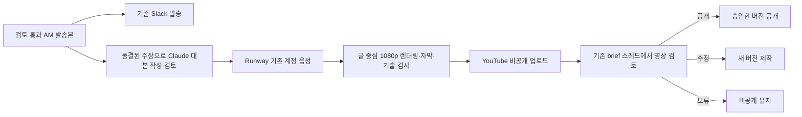

# Daily brief 영상 자동화

뭐든story의 아침 시장 브리핑은 **검토를 통과한 발송본의 글**을 중심으로 만든다.
대본·제목·화면·음성을 생성하고 비공개 업로드까지 자동화하며, 공개는 해당 영상을
끝까지 본 소유자가 Slack에서 승인한다. 새 역사 영상 제작 규칙과 별도로
[daily video 제작 기준](DAILY_VIDEO_PRODUCTION_STANDARD.md)을 적용한다.



## 구현과 현재 운영의 경계

이 경로는 구현했고 기본값은 꺼짐이다. 기존 Analyst의 발송 없는 품질 관찰과 운영 설정은
변경하지 않았다. `briefing_publish_enabled=true`인 실제 발송본 중 `ready`이고, 전체 검토 항목을 통과한
비축소 본문만 DB 커밋과 같은 트랜잭션에서 영상 작업을 만든다. 아침(AM) 발송본은 "아침 시장 브리핑", 한국장 마감(PM)
발송본은 "마감 브리핑" 회차가 된다. 회차마다 brief edition ID가 달라 같은 날 두 영상의 작업·파일·Slack 메시지가 서로
덮어쓰지 않는다. 미리보기, 미검토 초안, 축소본, 대체 공지, 기준 시각 이후 자료는 작업을 만들지 않는다.
Slack 발송 실패가 영상 제작을 되돌리지 않으며, 검토 링크는 brief의 Slack 수신 시각을 확인한 뒤 그 스레드에 게시한다.

일정은 브리핑 일정(`briefing/schedule.py`)을 그대로 따르므로 휴장일 처리도 같다. 브리핑이 만들어지지 않는 날은
영상도 만들지 않는다.

| 회차 | 원문 발송 | 검토본 준비 목표 | 공개 승인 만료 |
| --- | --- | --- | --- |
| 아침 | 07:45 KST | 08:30 KST | 09:00 KST |
| 마감 | 17:45 KST 또는 한국장 마감+65분 중 늦은 시각 | 발송+1시간 45분 (기본 19:30 KST) | 목표+2시간 30분 (기본 22:00 KST) |

목표 시각까지 검토본이 없으면 한 번 상태를 알리고, 만료 뒤에는 새 생성과 일반 공개 승인을 중단한다.
공개 요청 직전에도 마감과 계정·파일을 확인한다. 목표 시간의 실제 달성은 서버 사양과 실제 음성으로 관찰해야 한다.

## 비용과 계정

대본 작성(`video_plan_v1`)과 별도 검토(`video_review_v1`)는 서버의 기존 Claude 구독 실행기
([Claude runtime](claude-runtime.md), Pro/Max 공식 로그인, `claude-opus-5`)에서 실행한다. Codex runtime으로
자동 전환하지 않으며 Codex는 영상 계약을 받지 않는다. 실행기는 요청 계약에 맞는 JSON schema만
`--json-schema`로 전달하고 도구·MCP·세션 저장 없이 한 번 실행한다. 직원 독립 검토와 같은 단일 실행 lane과
구독 한도를 공유한다. lane 사용 중(`busy`)이나 구독 한도 소진(`quota`)은 실행 전 거절이므로 호출 예약을
반환하고 같은 요청 ID로 나중에 재시도한다. 회사 일일 호출 제한 집계는 그대로 적용한다.
검색·앱·MCP·셸 도구와 media credentials는 모델에 전달하지 않는다. Claude 계정의 usage credits/extra
usage가 꺼져 있어야 하며(`CLAUDE_USAGE_CREDITS_DISABLED_CONFIRMED=true`) 결제 API 키로 전환하지 않는다.
Runway 음성은 OAuth로 `https://mcp.runwayml.com/mcp`에 연결한다.
[공식 Runway 안내](https://help.runwayml.com/hc/en-us/articles/51931843164691-Connecting-to-Runway-MCP)에
따르면 이 MCP는 웹 계정 크레딧을 사용한다. `dev.runwayml.com/mcp`와 직접 유료 API로 전환하지 않는다.
기존 ChatGPT 앱 연결 토큰이 서버로 자동 이관되지는 않으므로 서버에서 처음 한 번 로그인한다.

음성 모델은 `eleven_multilingual_v2`, 기본 voice는 Runway preset `Vincent`다. 현재 확인한 MCP 조건인
문자 50개당 1 credit을 **장면별 올림**으로 예약한다. 실제 한국어 발음·서비스 조건은 첫 비공개
샘플에서 다시 확인한다. 예를 들어 한 회 3,000자는 최소 약 60 credits이고,
26회면 약 1,560 credits라서 기본 월 제한 1,500을 넘길 수 있다. 수정본도 같은 회차 한도에 합산한다.
기존 다른 영상이 같은 계정 잔액을 쓰므로 생성 직전 잔액과 workspace를 확인한다.
월 한도는 아침·마감 두 회차를 합친 값이다. 회차 한도는 회차(edition)마다 따로 센다. 장면을 내기 전에 남은 장면 전체의
예상 크레딧을 먼저 검사해, 한도를 넘으면 첫 요청도 보내지 않고 작업을 `blocked`(Insufficient narration budget)로 멈춘다.
예상치는 장면(음성 1회 생성)마다 시작한 500자당 1 credit이고, 다시 만들 몫으로 남은 장면 수의 20%를 더해 검사한다.
2026-10-07 Runway 웹(ElevenLabs Eleven v4)에서는 55~210자 장면 20회 생성에 1회당 1 credit이 차감됐다. 19장면 회차면
예상 19+4=23 credits, 하루 두 편·한 달 약 60편이면 약 1,400 credits라 기본 월 한도 1,500 안에 든다. 한도 검사 자체(월 1,500·회차 100)는 그대로다.
잔액·월/회차 한도가 부족하면 중단한다. 구매·충전 도구와 자동 유료 API fallback은 없다.
원화 5만원은 추가 지출 목표이며, 서버 증설과 별도 구독 구매는 이 코드가 실행하지 않는다.

화면은 [아침 시장 브리핑 디자인 명세](DAILY_BRIEF_DESIGN_SPEC.md)의 고정 틀(`VIDEO_TEMPLATE=motion-v2`, 기본값)로 만든다.
Claude는 `video_episode_v1` 계약으로 정해진 카드 종류와 필드만 채운다(`video/episode.py`). 화면 배치·색·모션은
패키지에 포함된 템플릿(`video/design/`, Pretendard OFL 글꼴 포함)이 정한다. 검사기는 화면·티커·자막·내레이션의
모든 숫자가 해당 장면이 인용한 동결 원문 주장 안에 있는지(부호는 ▲▼로 표시하므로 절댓값 비교), 카드 종류·아이콘·
지도 지역·이미지 ID가 허용 목록 안에 있는지 확인한다. `motion.py`는 실제 음성 단어 타임스탬프로 자막을 맞추고,
장면 최종 상태에서 글자 겹침·카드 넘침·빈 공간·자막 3줄을 DOM으로 검사한 뒤 `seek(t)`로 30fps 프레임을 찍어
FFmpeg로 합성한다. 검사 실패, true peak -1.5 dBTP 초과, 검은 화면·긴 무음이면 결과를 만들지 않는다.
이 템플릿 이전에 만든 작업은 정책에 기록된 `text-v1`로 그대로 렌더한다.

이미지는 서버에서 매일 찾지 않는다. 사람이 검수한 라이브러리(`${STATE_DIR}/video-assets`, 읽기 전용 mount)의
`manifest.json`에 있는 ID만 쓸 수 있다. 자료사진은 CC0·퍼블릭 도메인·CC BY만 쓰고 화면 칩(자료사진 · 저작자 ·
라이선스)과 업로드 설명란 출처를 렌더러가 manifest에서 자동으로 만든다. 일러스트는 Codex 구독으로 만든 비사진풍
그림이며 "일러스트" 칩을 단다. 라이브러리 원본은 iCloud `뭐든story/아침브리핑/library/`(images·photos·manifest.json)에
있고 서버 반영은 사람이 복사한다. 음악은 출처가 정해질 때까지 넣지 않는다.
렌더링 시도마다 별도 디렉터리를 쓰므로 중단된 렌더가 승인한 파일을 덮어쓰지 않는다.
DB와 media-auth는 기존 복구 정책에 포함하고, 업로드 영상·manifest·영수증을 함께 백업한다.
렌더와 검사가 끝나면 중간 파일(프레임 조각, 무음 영상, 음성 WAV, 화면 폴더, 회차당 약 0.2GB)을 바로 지운다.
최종 MP4·자막·문안·manifest는 작업이 끝난(공개·만료·보류·대체·차단) 뒤 `VIDEO_RETENTION_DAYS`(기본 14일)가 지나면 지운다.
DB의 계획·영수증·파일 해시는 남는다. 영상 볼륨 여유가 `VIDEO_MIN_FREE_GB`(기본 10GB)보다 적으면 대기 중인 회차를
시작하지 않고 `blocked`(insufficient_disk)로 두며 brief 스레드에 한 번 알린다. 크레딧은 쓰지 않는다.
고정 댓글 문안은 업로드 패키지에 제공하며 댓글 자동 게시·고정은 이 버전에 포함하지 않았다.

## 서버 준비

`deploy/video.compose.yaml`은 선택 프로필이다. media worker만 OAuth 파일·영상 파일에 접근하고,
Slack 토큰은 기존 API/socket/dispatcher에만 있다.
[영상 설정 예제](../deploy/video.env.example)는 기존 private runtime.env에 필요한 값만 추가할 때 사용한다.
DB와 Temporal을 기존 서비스와 공유하며
media worker의 작업 큐는 `${TEMPORAL_TASK_QUEUE}-video`다. 모든 프로세스가 같은 버전의
코드·영상 플래그·brief owner/channel 설정을 사용해야 한다.

먼저 기존 app 이미지를 만들고 video 이미지를 만든다. 아래 명령은 템플릿이며 운영 서버에서
실행한 증거가 아니다. 기존 설치의 추가 overlay와 release 고정값을 유지한다.

```sh
docker compose -f deploy/compose.yaml build api
docker compose -f deploy/compose.yaml -f deploy/video.compose.yaml --profile video --profile claude build video-worker
```

video worker는 `claude-runtime`이 healthy일 때 시작한다. 항상 `--profile video --profile claude`를 함께 쓴다.
Claude 실행기 로그인과 usage credits 확인은 [Claude runtime 최초 연결](claude-runtime.md)을 따른다.
영상만 켤 때 `COMPANY_STAFF_REVIEW_ENABLED`를 켤 필요는 없다.

호스트의 `${STATE_DIR}/video`, `media-auth`, `video-models`, `video-assets`를 uid/gid 10001 소유로 먼저 만든다.
`media-auth`는 0700, 토큰/YouTube client 파일은 0600이다. 파일을 Git에 넣지 않는다.
video 이미지에 Chromium, FFmpeg, 한국어 Noto 폰트와 영상 optional dependencies가 들어 있다.
Whisper small은 `/state/models`에 캐시한다. 첫 다운로드와 최초 렌더링을 미리 끝낸다.
기본 worker 한도는 1.5 CPU/1536MiB다. 2GB 서버에는 켜지 않는다. 8GB(권장)·4GB 메모리 설정은
[8GB 예시](../deploy/lightsail-8gb.env.example)·[4GB 예시](../deploy/lightsail-4gb.env.example), 서버 이전은
[서버 요금제 변경 안내](server-migration.md)를 따른다. 렌더 속도는 `quant-company video bench`로 잰다. 추가 서버 구매·사양 변경을 자동으로 수행하지 않는다.

Google Cloud에서 해당 채널용 YouTube Data API v3와 Desktop OAuth client를 준비하고,
`media-auth/youtube-client.json`에 둔다. OAuth scope는 업로드와 `youtube.force-ssl`이다.
OAuth testing 상태의 refresh token 만료와 브랜드 계정 선택을 확인한다.
[YouTube 공식 문서](https://developers.google.com/youtube/v3/docs/videos/insert)는 미검증 API 프로젝트의
업로드가 비공개로 제한될 수 있다고 명시한다. 공개 기능은 필요한 심사와 채널 권한 확인 뒤 켠다.

로컬 또는 서버의 SSH 터널을 통해 로그인한다.

```sh
# 노트북에서: 로그인 동안만 유지
ssh -L 8766:127.0.0.1:8766 -L 8767:127.0.0.1:8767 SERVER
# 서버의 video worker가 실행된 뒤: container listener, 호스트 포트는 loopback에만 노출
docker compose -f deploy/compose.yaml -f deploy/video.compose.yaml exec video-worker \
  quant-company video-auth runway --listen-host 0.0.0.0
docker compose -f deploy/compose.yaml -f deploy/video.compose.yaml exec video-worker \
  quant-company video-auth youtube --listen-host 0.0.0.0
```

처음에는 플래그를 모두 false로 두고 worker를 실행할 수 있다. 로그인은 생성·업로드·공개를 하지 않는다.
출력된 authorization URL을 노트북 브라우저에서 열고 완료한다. 기존 ChatGPT 로그인이나
브라우저 쿠키를 복사하지 않는다. 서버·터미널 인증 출력은 공개 증거에 남기지 않는다.

| 설정 | 기본값 | 의미 |
| --- | --- | --- |
| `VIDEO_ENABLED` | false | 검토된 AM에서 영상 제작 허용; brief 발송도 허용되어야 함 |
| `VIDEO_UPLOAD_ENABLED` | false | 비공개 업로드 허용 |
| `VIDEO_PUBLISH_ENABLED` | false | 사람의 유효한 Slack 승인 후 공개 허용 |
| `VIDEO_RUNWAY_WORKSPACE_ID` | 0 | 명시적 기존 웹 workspace |
| `VIDEO_YOUTUBE_CHANNEL_ID` | 빈 값 | 명시적 해당 채널 ID |
| `VIDEO_MONTHLY_CREDIT_LIMIT` | 1500 | 예약/불확실 요청을 포함한 KST 월 한도 |
| `VIDEO_EPISODE_CREDIT_LIMIT` | 100 | 수정본을 포함한 회차 한도 |
| `VIDEO_MODEL` | claude-opus-5 | Claude 구독 대본·검토 모델; 다른 값이면 영상 활성화를 거부 |
| `VIDEO_MODEL_RUNTIME_URL` | http://claude-runtime:8080 | 기존 Claude 실행기 내부 주소 |
| `VIDEO_VOICE` | Vincent | Runway preset voice; 첫 실제 샘플에서 한국어 발음 확인 |
| `VIDEO_ALIGNMENT_MODEL` | small | 실제 음성 검증·자막 시점용 로컬 모델/경로 |
| `VIDEO_TEMPLATE` | motion-v2 | 카드·모션 고정 틀. text-v1은 이전 글 화면 |
| `VIDEO_RENDER_WORKERS` | 1 | 프레임 캡처 프로세스 수. 2GB 서버 실측 전에는 1 |
| `VIDEO_AM_REVIEW_TARGET` | 08:30 | 아침 검토본 목표(06:00~08:59). 공개 승인은 09:00에 만료 |
| `VIDEO_RETENTION_DAYS` | 14 | 작업 종료 뒤 최종 파일 보관 일수 |
| `VIDEO_MIN_FREE_GB` | 10 | 이보다 여유가 적으면 새 회차를 시작하지 않음 |

활성화 순서는 upstream full brief 품질 통과 → 계정/잔액/채널과 서버 자원 확인 →
첫 비공개 샘플 전체 시청 → 비공개 자동 제작 → 공개 승인 허용이다. 기존 Analyst Slack 앱의
interactivity를 켜고, HTTP 방식이면 `/slack/events/market_brief`로 설정한다.
`quant-company slack-manifests --include-market-brief ...`는 영상이 활성화된 설정에서
해당 interactivity를 포함한다. Socket Mode는 기존 인증 연결로 상호작용을 받는다.

## 상태와 복구

```sh
uv run --extra video quant-company video status
# 수동 점검: 한 단계만 실행. 실제 설정에서는 크레딧/쓰기가 발생할 수 있음
uv run --extra video quant-company video tick
uv run --extra video quant-company video-worker
```

운영 API `GET /v1/videos`는 operator 인증을 요구한다. 상태와 공개용 영상 ID만 보여 주며
토큰·signed media URL·resumable session은 출력하지 않는다. Temporal은 실행·타이머를,
PostgreSQL은 버전·예산 예약·task ID·승인·효과 영수증을 보존한다.

진행 중인 효과에 결과가 없으면 `uncertain`이다. Runway history의 기존 task를 확인하고
YouTube의 기존 session/video ID를 조회해 원래 요청 결과와 대조한다. 확인 전에는 작업/효과 행을
삭제하거나 새 음성·업로드 요청을 보내지 않는다. 알려진 upload session은
[공식 resumable protocol](https://developers.google.com/youtube/v3/guides/using_resumable_upload_protocol)에
따라 현재 offset을 조회해 이어 올린다. session이 만료되면 자동 대체 업로드를 만들지 않는다.
공개 요청 응답을 잃으면 실제 visibility를 확인하기 전까지 공개 완료라고 보고하지 않는다.
검토 메시지 전송이 불확실하면 기존 Slack client message ID/수신 결과를 대조한다.
복구 전에 DB·영상 파일과 해당 receipt를 보존하고 운영자 reconciliation 기록을 남긴다.

원래 요청의 확인된 receipt를 운영자가 비공개 JSON 파일에 작성하고 아래처럼 대사한다.
이 명령은 외부 생성/쓰기를 하지 않으며 원래 `running` 요청에 결과를 연결하고 기록을 남긴다.
`speech-N`은 원래 `taskId`, `upload-session`은 원래 `session`, `captions`는 `caption_id`,
`thumbnail`은 `video_id`와 `thumbnail_set=true`, `publish`는 기존 `video_id`와 확인한 `privacy=public`을
요구한다. 모델 receipt는 해당 `request_id`, typed `output`을 포함한다. 로컬 단말에 비밀 receipt를 출력하지 않는다.

```sh
quant-company video reconcile --job-id JOB_UUID --effect-key speech-0 \
  --receipt-file /private/verified-receipt.json --note '원래 요청의 task ID와 계정 생성 이력을 대조함'
quant-company video retry --job-id JOB_UUID --note '기존 음성 task와 로컬 렌더 환경을 확인하고 복구함'
```

`retry`는 미확인 요청이 없는 로컬 렌더링 또는 기존 upload session만 재개한다.
크레딧 요청이나 새 업로드를 자동 재전송하는 복구 명령은 없다. Claude 실행기의 `busy`와 `quota`는 실행 전에
반환되는 명시적 거절이므로 모델 호출 예약을 반환하고 같은 요청 ID로 재시도한다(`busy` 최대 60초,
`quota` 최대 15분 뒤). 09:00 마감은 그대로 적용된다. 모델 timeout이나 응답 유실은 재시도하지 않는다.
실행기의 `claude/jobs/video-<job>-<phase>.json` receipt와 DB 효과 행을 먼저 대사한다.

검토 불합격이나 기술 검사 실패는 `blocked`, 보류는 `held`, 새 수정본은 이전 버전을
`superseded`로 만든다. 이전 버전의 버튼은 새 버전을 승인하지 못한다. 09:00 이후에는
최신성 재검토를 거친 별도 발간으로 다뤄야 하며 일반 승인 버튼으로 연장하지 않는다.
자동 기술 QA는 수치 의미와 전체 청취를 보증하지 않는다. 소유자의 전체 시청이 최종 조건이다.

## 로컬 데모와 검증

```sh
uv sync --extra video
uv run --extra video playwright install chromium
# FFmpeg/ffprobe 설치 후 macOS 기본 음성으로 로컬 디자인 샘플 생성
uv run --extra video python demos/daily_video.py
# Linux에서는 샘플 대본을 읽은 로컬 파일 세 개를 --audio로 제공
uv run --extra video pytest tests/test_video*.py
uv run ruff check .
```

데모는 합성 문안과 macOS 음성/제공 음원을 사용한다. Runway 과금과 YouTube 업로드를 하지 않는다.
Chromium/FFmpeg 실제 렌더링, 실제 오디오 시간과 로컬 ASR를 확인한다. 자동 테스트의 cloud/Slack/model은
명시적 fixture이며 PostgreSQL·Temporal·Chromium·FFmpeg 확인과 구분한다.
[구현 검증 기록](project/DAILY-VIDEO-VALIDATION.md)에 최종 검사와 남은 운영 연결을 기록한다.
