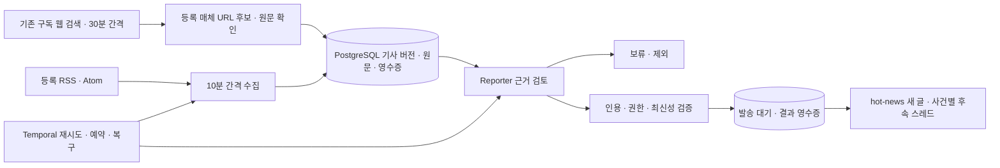

# Reporter — hot-news

Reporter는 국내외 경제·금융, 거시경제, 세계 정세, 무역·에너지·공급망, 주요 기업·산업·기술,
글로벌 주요 사건의 새 소식을 수집하고, 근거를 검토한 뒤
`hot-news`에 한국어로 전달하는 별도 Slack 앱이다. 이름은 `Reporter`, 멘션은 `@reporter`,
소개는 “주요 경제·국제 뉴스를 확인하고 전하는 리포터”다.
구현 자격검증은 [검증 기록](project/HOT-NEWS-VALIDATION.md), 후속 앱 연결과 운영 활성화는
[활성화 기록](project/HOT-NEWS-ACTIVATION.md)에 구분해 남긴다.

## 동작



- 피드별 기본 수집 간격은 600초다. HTTP 조건부 요청과 실패 시 최대 1시간의 재시도 간격을 쓴다.
  편집 검토는 5분마다 새 자료가 있을 때만 실행한다. 보류 기사는 새 자료가 생길 때 함께 검토한다.
  추가 검색은 30분 간격으로 6개 분야를 순환하고, 최근 보류 기사 최대 2건의 독립 보도도 찾는다.
  검색 결과·스니펫은 근거로 쓰지 않고 등록된 매체의 실제 원문과 발행 시각을 확인한다.
  확인을 통과하면 기존 dispatcher가 발송한다. 모델 사용량·사용자 업무·원문 장애 때문에 늦어질 수 있다.
- 수집은 별도 Temporal task queue에서 실행한다. 편집·검색은 기존 구독 모델 작업과 같은 worker의
  동시 실행 1개 한도와 회사 공통 일일 한도를 사용한다. 대기 중인 사용자 업무를 먼저 처리한다.
- 신규 피드 최초 수집은 최근 120분, 정상 재개 후에는 최근 24시간 자료를 편집 대상으로 삼는다.
  오래되거나 발행 시각이 없거나 5분을 넘겨 미래인 기사는 기록만 한다. 날짜를 현재 시각으로 대체하지 않는다.
  GOV.UK처럼 수정 시각만 제공하는 등록 피드는 원문의 `govuk:first-published-at`을 추가 확인한다.
  최초 발행 시각이 허용 기간 밖이면 최근 수정된 문서여도 게시하지 않는다.
- URL 정규화와 피드 내용 해시로 기사 버전을 구별한다. 동일 사건은 모델이 묶고 최근 사건과 비교한다.
  같은 원문의 변경 버전은 기존 사건의 후속이어야 한다. 재표현만으로 후속 글을 만들지 않는다.
- 원문은 공개 HTTPS HTML/text만 읽는다. 기사 영역을 먼저 추출하고 최대 6,000자의 근거를 전달한다.
  기사 영역이 없거나 부족하면 게시 근거로 쓰지 않는다. 원문 해시·조회 시각·추출 방식·잘림 여부를 보존한다.
  로그인·유료벽·PDF·JavaScript 렌더링은 지원하지 않는다.
- 공식 기관 자체의 정책·통계·행위는 그 기관의 원문으로 확인한다. 일반 보도는 명시적으로
  등록된 매체의 원문을 읽고 `보도` 및 `매체명 보도에 따르면`을 표시해 전달할 수 있다.
  독립 확인은 서로 다른 보도 원천 2개 이상을 요구한다. 의혹·익명 주장·피해 인원·예측·의견은
  단일 매체 보도 모드로 게시하지 않는다. 같은 통신사 전재나 같은 원문은 독립 확인 2건이 아니다.
  정부가 상대국에 관해 한 주장만으로 사건을 확정하지 않는다.
- 코드가 기사 ID·인용문의 실제 포함 여부·출처 유형·등록 원천 수·시각·허용 채널을 검사한다.
  중요도, 인용과 주장 사이의 의미 관계, 재전재 여부 및 사건 통합에는 모델 판단이 남는다.
  **자동 검토 통과가 사실의 독립적인 완전 검증을 뜻하지 않는다.**

게시물에는 제목, 확인된 사실, 중요성에 관한 해석, 원문 링크, 발표 시각과 확인 시각(KST)을 넣는다.
후속·정정은 원 글의 스레드로 보내며 긴급한 후속만 채널에도 알린다. 원 글의 발송 결과가
불명확하면 후속을 보류한다. `@channel`·`@here` 알림이나 뉴스 개수 채우기는 하지 않는다.
게시된 뉴스 스레드의 사용자 질문은 Reporter가 해당 원문을 읽고 답한다.
`daily-brief` 정기 브리핑은 별도 후속 과제다.

## 실제 소스 조사

초기 후보 조사와 운영 등록은 구분한다. 초기 [RSS 영수증](project/evidence/hot-news-source-probe.json)은
과거 조사 기록이다. 현재 설정은 아래와 같으며 운영지 원문 검사는 활성화 기록에 남긴다.

| 소스 | 실제 연결 | 본문·게시 근거 상태 |
|---|---|---|
| 연준 발표 | RSS·원문 확인 | 기관 자체 정책·통계·조치 |
| ECB 발표 | 운영 서버 RSS 연결 확인; 로컬 인증서 오류 별도 기록 | `/press/pr/`, `/press/govcdec/` 자체 발표만 허용. 연구물·인터뷰·연설 제외 |
| 미국 BEA | RSS·원문 확인 | GDP·소득·국제수지 등 자체 통계 발표 |
| 영국 FCDO·재무부·통상부 | 뉴스 전용 Atom·원문 확인 | OGL 공개 발표. 원문 최초 발행 시각 확인, 출처·라이선스·AI 한국어 요약 표시 |
| BBC 국제·경제·기술 | 무료 RSS 3개 | 공개 기사 영역·JSON-LD 발행 시각·기자 표시. 일반 보도 후보 |
| KBS World 전체·경제 | 무료 RSS 2개 | 한국 경제·외교·안보 등. RSS 발행 시각과 실제 기사 본문 확인 |
| CNBC 국제·경제·금융·기술 | 무료 RSS 4개 | 금융·무역·기업·기술 보도. 공개 원문과 메타데이터 확인; 유료벽 제외 |
| 연합뉴스 경제·마켓·산업·국제 | 무료 RSS 4개 | 개인 비상업 RSS. 공개 원문·실제 발행 시각·기자 확인 |
| SBS 경제·국제 | 무료 RSS 2개 | 개인 비상업 RSS. 기사 영역·발행 시각 확인. RSS와 검색의 추적 매개변수 차이를 정규화 |
| 이투데이 경제·금융·산업·국제 | 무료 RSS 4개 | 비상업 RSS. 공개 `articleBody`와 발행 시각 확인 |
| 뉴시스 국제·경제 | 운영 수집 비활성 | 자동 수집 제한을 확인해 제외 |
| 미국 BLS | 로컬·운영 서버 HTTP 403 | 접근 차단을 우회하지 않고 운영 등록 보류 |

연준·ECB는 각 기관이 공개하는 공식 피드 목록을 근거로 등록했다.
[연준 RSS 안내](https://www.federalreserve.gov/feeds/feeds.htm),
[ECB RSS 안내](https://www.ecb.europa.eu/home/html/rss.en.html).
이용 근거와 제한은 [ECB 이용 안내](https://www.ecb.europa.eu/services/using-our-site/disclaimer/html/index.en.html),
[BEA 정책](https://www.bea.gov/about/policies-and-information),
[GOV.UK 재사용 안내](https://www.gov.uk/help/reuse-govuk-content),
[뉴시스 이용약관](https://mobile.newsis.com/policy/)을 확인했다.
GOV.UK의 정부 부처들은 모두 `uk-government` 원천으로 묶으므로 서로 독립인 보도로 계산하지 않는다.

Reuters와 AP는 후보이며, 이 구현에 계약·키·API 연결을 추가하지 않았다.
Reuters는 AI/RAG 활용용 콘텐츠 제공 경로를, AP는 API의 인증·접근 범위를 안내한다.
[Reuters AI 콘텐츠](https://reutersagency.com/solutions/ai-training-rag/),
[AP API 시작 안내](https://api.ap.org/media/v/docs/Getting_Started_API.htm).
2026-09-21 사용자 지시에 따라 **추가 비용 없이 기존 구독·무료 소스를 우선**한다.
같은 날 사용자가 확장을 승인한 구성은 일반 언론 RSS 19개(매체 6개)와 공식 피드 6개다.
정확한 배포 상태와 시점은 [주요 매체 확장 기록](project/HOT-NEWS-MAINSTREAM-EXPANSION.md)을 따른다.
기존 ChatGPT 구독 검색을 보완 경로로 쓴다. 검색에서 Reuters·AP·Bloomberg·FT·WSJ·CNBC와
국내 주요 경제 매체가 다룬 사건을 찾아보되, 반환 URL과 게시 근거는 허용된 공개 매체 원문만 사용한다.
이는 해당 유료 매체의 본문 수집·API 연결·기사별 감시를 제공한다는 뜻이 아니다.
공개 RSS를 개인 뉴스 읽기에 사용하고 소유자의 Slack에 짧은 사실 요약과 원문 링크를 전달한다.
기사 전문·사진·영상의 재배포나 모델 학습에 사용하지 않으며, 상업적 콘텐츠 이용권을 취득했다는 뜻이 아니다.
[BBC RSS 안내](https://support.bbc.co.uk/platform/feeds/NewsFeeds.htm),
[KBS RSS 안내](https://world.kbs.co.kr/service/about_rss.htm?lang=e),
[연합뉴스 RSS 안내](https://www.yna.co.kr/rss/index),
[연합뉴스 저작권규약](https://www.yna.co.kr/policy/copyright),
[SBS RSS 안내](https://news.sbs.co.kr/news/rss.do), [이투데이 RSS 안내](https://www.etoday.co.kr/rss/).
한국경제·매일경제·동아일보·뉴시스처럼 자동 수집 제한이 확인된 소스, 계약·접근이 필요한 Reuters/AP API,
접근 차단 페이지는 추가하지 않는다. GNews 결제·유료 API 키·신규 서버 구매는 하지 않았다.
사용자는 지역별 매체 안배를 원하지 않았으므로 CNA·DW·France 24 등의 지역 보강용 매체를
추가하지 않는다. 세계적으로 중요한 사건을 발생 지역 때문에 제외하는 필터도 두지 않는다.
분야 등록은 실제 사건의 포괄적 수집 증명이 아니다. 세계 주요 사건의 누락률과 독립 확인의
충분성은 지속 관찰 대상이다. 실제 분야별 기사는
[범위 복원 인수](project/HOT-NEWS-SCOPE-RESTORATION.md)에 기록한다.

소스 목록은 [sources.json](../src/quant_company/news/sources.json)에 있다.
`enabled`는 피드 수집, `use_for_summary`는 본문 수집·모델 입력·게시 근거 사용을 제어한다.
후자가 false이면 피드의 본문 요약도 저장하지 않는다. 변경은 검토된 설정으로 배포하며 모델이
활성화하거나 사용 권한을 부여할 수 없다. 소스·정책 변경은 진행 중인 검토와 미발송 게시물의
유효성을 취소한다. 변경 전 결과를 새 호출로 자동 재생성하지 않는다.

## 연결과 설정

1. [reporter.json](../slack-apps/reporter.json)을 Slack 앱 관리의 **From a manifest**로 설치한다.
   앱 이름은 Reporter이며 다른 직원의 토큰을 재사용하지 않는다. Socket Mode 앱 토큰에는
   `connections:write`를 부여하고 Reporter를 실제 `hot-news` 채널에 초대한다.
2. 기존 서버의 비밀 저장소에 `reporter` 항목의 `app_id`, `bot_user_id`, `bot_token`, `app_token`을
   추가한다. HTTP Events를 사용할 때만 `signing_secret`이 필요하다.
   토큰을 채팅·Git에 넣지 않는다. 나머지 앱의 자격 증명은 유지한다.
3. 서버에 마운트하는 `roles.json`에도 패키지의 `reporter` 역할을 추가한다. 기존 역할별 사용자
   설정을 통째로 덮어쓰지 않는다. `COMPANY_NEWS_ENABLED=true`가 이 역할을 활성화한다.
4. 아래에 실제 ID를 지정하고 소유자와 채널을 기존 허용 목록에도 추가한다.
   모든 회사 프로세스에 같은 정책을 전달한다. Compose는 공통 설정을 전달하며
   Codex 컨테이너에는 DB·Slack 자격 증명을 추가하지 않는다.

```dotenv
COMPANY_NEWS_ENABLED=true
NEWS_PUBLISH_ENABLED=false
NEWS_SEARCH_ENABLED=false
NEWS_CHANNEL_ID=C_ACTUAL_HOT_NEWS_ID
NEWS_OWNER_USER=U_ACTUAL_OWNER_ID
NEWS_MAX_AGE_HOURS=24
NEWS_INITIAL_LOOKBACK_MINUTES=120
```

2026-09-19 실제 운영에서는 두 활성화 설정을 모두 true로 켰고, 최초 lookback을 1,440분으로
지정했다. 신선도 상한은 그대로 24시간이다. 실제 채널·커밋·게시 영수증은 활성화 기록을 따른다.
2026-09-21 주요 매체 확장에서는 신규 피드의 초기 입력을 최근 120분으로 제한한다.
이미 수집하던 피드의 정상 재개 기준 24시간과 기존 게시물은 유지한다.

패키지와 배포 템플릿의 수집·발송·추가 검색 기본값은 false다. 미리보기에서는 검토 결과만 저장하며
outbox에 넣지 않는다. 실제 채널·앱 권한·운영 소스와 결과를 확인한 후
`NEWS_PUBLISH_ENABLED=true`로 운영 발송을 켠다. 미리보기의 과거 기사를 뒤늦게 게시하지 않는다.
설치·마이그레이션·프로세스 재시작은 [기존 배포 절차](deployment.md)를 따른다.

## 점검 명령과 데모

```bash
uv sync --frozen
uv run --frozen quant-company slack-manifests --include-reporter --output .local/news-apps
uv run --frozen quant-company news probe --output .local/news-sources.json
```

`probe`는 활성화된 공개 피드만 검사하며 DB·모델·Slack은 사용하지 않는다. 비활성 소스는 조회하지 않는다. manifest 생성 역시 앱을
설치하지 않는다. 아래 명령은 설정된 DB에 연결하므로 개발용 DB 또는 확인한 운영 환경에서 사용한다.
`collect`는 피드 1개와 원문 최대 1개, `review`는 편집 검토 최대 1회를 수행한다.
일상적인 상시 실행은 `worker`·`dispatch`의 Temporal 워크플로가 담당한다.

```bash
uv run --frozen quant-company migrate
uv run --frozen quant-company news collect
uv run --frozen quant-company news review
uv run --frozen quant-company news status
```

`news status`는 수집 성공 시각·최근 기사 시각·오류, 분야별 소스·최근 기사 존재, 추가 검색 상태,
기사 상태, 검토 결과, **실제 Slack 전달 상태**를
구분한다. Reporter에게 수집 상태를 물어도 같은 읽기 도구를 사용한다.
outbox의 `pending`은 발송 대기, `delivered`는 Slack 성공 영수증 확보, `uncertain`은 결과 불명이다.
기사의 `queued`는 게시 큐로 넘겼다는 뜻이며 현재 Slack 전송 여부는 outbox를 확인한다.
결과 불명인 모델 호출·Slack 발신은 자동으로 새 ID를 만들어 반복하지 않는다.
운영자가 원격 영수증과 Slack 기록을 대조해야 하며 이 버전에는 뉴스 전용 재발행 명령이 없다.
중지하려면 `COMPANY_NEWS_ENABLED=false`와 `NEWS_PUBLISH_ENABLED=false`를 모든 관련 프로세스에
반영한다. 이미 네트워크로 전송 중인 메시지까지 취소하는 기능은 아니다.

실제 RSS→원문→구독 모델→미리보기 검사는 아래처럼 명시적으로 실행한다.
기존 공식 ChatGPT 인증, 임시 DB 생성 권한이 있는 로컬 PostgreSQL이 필요하다.
자격 검사에 한해 최신 피드 기사 1건을 실제 날짜 그대로 72시간 범위에서 선택하고,
정상 재개 상태를 합성으로 설정한다. 기본 운영 신선도 24시간을 검사한 것으로 해석하지 않는다.
호출 1회·Slack 0회이며 보류·제외도 유효한 검토 결과다.

```bash
uv run --frozen python scripts/qualify_news.py --live --output .local/news-live.json
uv run --frozen pytest -q tests/test_news.py tests/test_news_temporal.py
```

DB와 Codex 실행 영수증은 기존 백업 절차에 포함한다. 장기 데이터 보관·삭제 자동화,
장시간 소스 가용성/뉴스 누락 측정, 운영 경보, 광범위한 편집 품질 평가는 이 버전에서 검증하지 않았다.
