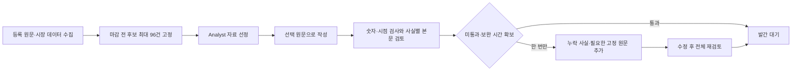

# Analyst 브리핑 경로 진단과 보완 — 2026-09-29

현재 일일 시황 품질을 높이는 우선순위는 **Analyst의 자료 선정과 원문 전달, 누락 검토**다.
Quant Scout는 퀀트 연구·논문 큐레이션을 담당하며, 일일 브리핑의 원문 공급 경로가 아니다.
브리핑은 Reporter의 `news_articles`, 등록 매체의 직접 수집, 별도 시장 데이터 수집기를 사용한다.
이번 변경에서 Quant Scout의 역할이나 연구 피드는 변경하지 않았다.

## 진단 근거

1. 기존 09/28 오후 평가에서는 적격 원문 151건 중 16건을 골랐지만, 사진 설명에 종가가 있는
   ETF 기사가 마감 종합 기사 자리를 차지했다. 필요한 원문은 수집돼 있었다.
   이전 선택기 수리가 종합 마감을 되살렸지만 제목 점수와 주제별 할당만으로 중요도를 정하는
   구조는 여전히 기업 사건·반대 근거를 놓칠 수 있었다.
2. [원문 전달 대조](evidence/briefing-pipeline-20260929/input-loss-audit.json)에서 이전에 선택된
   기사 ID를 그대로 유지해 비교했다. 오전 4건에서 10,047자, 오후 3건에서 6,570자가 저장돼
   있었는데도 3,000자 재절단으로 작성자에게 전달되지 않았다. 협상 조건·정책 시한 등이 본문 뒤에
   있을 수 있다. 복구한 글자 수 자체를 내용 품질 점수로 취급하지 않는다.
3. 종전 검토는 기사별 `covered`와 인용 항목만 연결했다. 기사 안의 중요한 두 번째 전개나
   본문 밖에 숨은 사실을 구별하는 기계적 검사가 부족했다. 보완 입력에는 최대 8개 일반 지적만
   전달돼 원문별 누락을 충분히 복구하기 어려웠다.
4. 이전 오후 평가의 요청 시작부터 최종 검토까지 약 23분 7초가 걸렸지만 입력 고정부터 발간까지는
   20분이었다. 실제 수집·대기열·전송까지 포함한 시간은 추가로 필요하다.

## 변경한 처리 흐름

- 자료 선정은 같은 구독형 `gpt-6-astra / high`를 한 번 호출한다. 후보의 제목과 앞뒤 발췌를
  비교하고 최종 기사 최대 16건을 선택한다. 서비스는 알려진 ID·중복·필수 마감 기사·자료 시점·
  본문 합계 42,000자 제한을 검사한다. 선택 이유와 질문은 원문 근거를 대신하지 않는다.
- 작성·검토에는 현재 수집기가 저장한 기사 본문을 최대 6,000자까지 전달한다. 일정은 기존
  3,000자 제한을 유지한다. 상류 수집기가 잘랐는지도 표시하며, 전체 원문을 읽었다고 주장하지 않는다.
- 검토자는 기사별 중요 사실, 정확한 원문 인용, 그 사실이 반영된 본문 항목을 반환한다. 상세
  스레드·인용문·내부 제한 설명만으로 중요한 사실을 반영했다고 인정하지 않는다. 빠진 사실이
  있는데 `coverage=true` 또는 `publish`라면 검토를 거절한다.
- 검토자에게 미선택 후보 제목도 전달한다. 누락된 사건이 있으면 같은 마감 전에 고정한 원문에서
  최대 4건을 요청할 수 있다. 요청한 검토는 미통과이며 기존 한 차례 보완에서 원문을 추가해
  수정·재검토한다. 새 검색·새 날짜 자료나 추가 반복을 넣지 않는다.
- 검토 요청의 인용문과 원문 안에서 반복되는 같은 구절은 한 번만 싣고 참조한다. 원본 응답과
  원문은 그대로 저장하고, 참조를 풀면 원문 전체가 정확히 복원되는지 검사한다. 수집용
  메타데이터와 선정자의 결론은 검토 입력에서 제외한다. 모델 슬롯·일일 회사 한도는 유지하며,
  자료 선정 단계에도 브리핑 우선순위를 적용한다.
- 발간은 07:30/20:00 KST를 유지한다. 수집 시작은 50분 전, 입력 고정은 30분 전으로 변경했다.
  일반일의 기준 시각은 07:00/19:30이다. 10분 더 이른 입력을 쓰는 대가로 검토 시간을 확보한다.
  실제 정시 발간 자격은 별도 검증 대상이다.

PostgreSQL에 자료 선정 호출·선택 결과·후보 원문을 저장하고 Temporal이 기존 편집 워크플로에서
다음 단계로 진행한다. 결과 불명 요청은 새 ID로 재실행하지 않는다. 수정된 입력 선택·검증 계약은
기존 저장본을 새 정책의 자격으로 인정하지 않는다.

## 실제 원문 평가 기록

[사전 기준](evidence/briefing-pipeline-20260929/evaluation-policy.json)을 고정한 뒤 미사용
09/29 오전판의 07:00 KST 이전 원문 173건을 읽었다. 후보 96건을 선정 단계에 전달했다.
첫 요청은 실행기가 `busy`로 거절했고, 같은 요청 ID·같은 입력의 다음 시도는 실제 Codex로
82.206초에 완료됐다. 후보 원문 전체는 저장하며 모델에는 제한된 발견용 발췌를 보냈다.

16건을 고른 첫 결과는 미국장 종가, 금리·환율, 이란의 협상 부인과 조건부 완화, 사우디 공급 회복,
무역·AI 규제 정보를 확보했다. 그러나 [독립 점검](evidence/briefing-pipeline-20260929/source-plan-independent-check.json)은
큰 신규 기업 인수 사건이 빠진 것을 확인했다. 따라서 최초 고정 정책의 전체 내용 자격은 통과가
아니다. 이 결과를 계기로 미선택 후보 검토와 같은 원문 풀에서의 보완 요청을 추가했다.
이후 진행은 [개발 평가 기준](evidence/briefing-pipeline-20260929/development-policy-v14.json)에
따른 개발 검증이며 신규 날짜의 통과로 바꾸지 않는다.

작성 결과를 보기 전에 [후보 원문 점검표](evidence/briefing-pipeline-20260929/candidate-reading-notes.json)와
[선택 원문 점검표](evidence/briefing-pipeline-20260929/selected-reading-notes.json)를 남겼다.
실제 모델 결과·최종 시간·독립 본문 대조는 아래 실행 완료 기록으로 추가한다.

첫 작성 호출은 694.269초가 걸렸다. 초안의 검토 입력은 원문과 인용의 중복 때문에 104,431자로
88,000자 계약을 넘었다. 의미 기준이나 원문을 줄이지 않고 위의 참조 형식으로 바꾼 결과
86,140자로 들어갔다. [손실 없는 전달 대조](evidence/briefing-pipeline-20260929/lossless-review-input-audit.json)는
선택 원문 16건을 모두 정확히 복원하고 미선택 후보 80건을 그대로 전달하는 것을 확인했다.
이 기술 수리 이후 검토를 실행하는 것도 같은 개발 평가의 연속이다.

첫 검토는 394.918초가 걸렸고 `reduce`, 5/12 항목 통과였다. 검토자는 AMD 인수뿐 아니라
다른 대형 AI 거래, 호르무즈 공급 회복, 베선트의 긴축 반대 발언 원문을 요청했다. 원유 월물의
시점 문제와 본문에서 빠진 정책·시장 내부 정보도 지적했다. 원문 추가 기능이 실제 누락을
발견했지만, 이 결과는 좋은 브리핑이 완성됐다는 뜻이 아니다.

검토 응답의 한 사실은 동시에 거절된 문단을 가리켜 검증 15에서 응답 전체가 거절됐다.
실제 초안에 있던 문장을 지적할 수는 있어야 하므로, 부정적 검토는 그 연결을 허용하되 문단
제거 후 살아남지 않는 사실은 내용 통과로 인정하지 않고 보완 목록으로 넘기도록 고쳤다.
원래 `reduce`나 미통과 항목을 통과로 바꾸지 않았다.

보완 요청도 처음에는 107,103자로 상한을 넘었다. 중복된 작성 지시를 정리하고, 보완 목록에는
빠진 사실만 남겼으며, 이전 초안의 반복 출처 ID는 되돌릴 수 있는 참조로 바꿨다. 전체 원문은
그대로다. [보완 전 고정 기록](evidence/briefing-pipeline-20260929/development-policy-v17.json)의
추가 후 원문 20건은 38,454자, 실제 보완 입력은 83,459자다. 기준과 문구를 조정한 이 연속
실행 역시 개발 검증으로만 기록한다.

## 운영상의 남은 일

이 변경은 서버 배포·Slack 게시 활성화가 아니다. 새 정책의 새 날짜 내용 검증, 배포 계약을 지킨
서버 미리보기, 독립 시장 데이터와 핵심 숫자 대조, 5거래일 정시 실행·실제 Slack 영수증 확인이
남아 있다. 수집 원문이 6,000자를 넘어 잘린 경우와 96건 후보 밖의 중요한 사건도 여전히 있을 수
있으므로 새 구조가 전 세계 뉴스의 완전성이나 전문가 자격을 보장한다고 주장하지 않는다.
