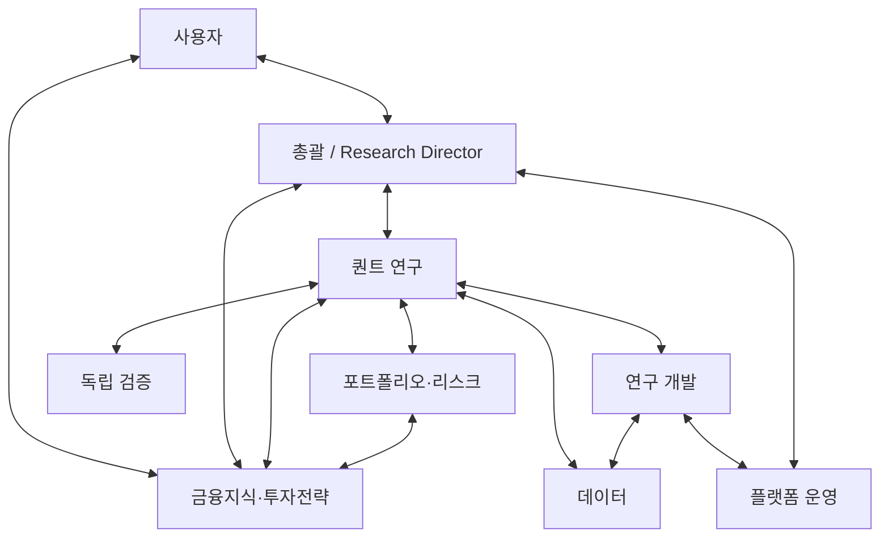
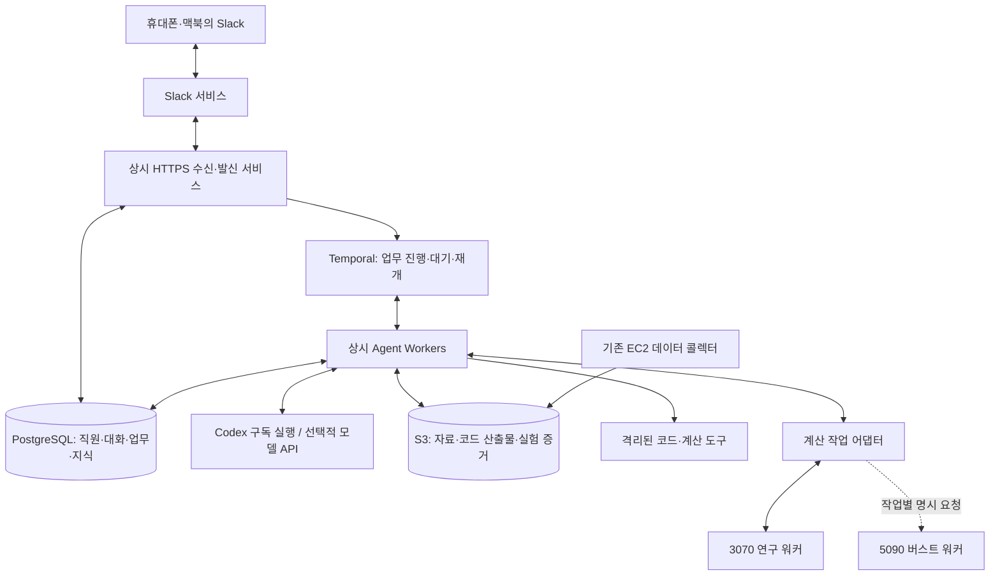

# Quant AI Company — Slack에서 일하는 상시 연구 조직

- 작성: 2026-09-16
- 상태: 첫 회사 서비스 구현·로컬 검증 완료 단계. 실제 Slack 설치·클라우드 배포는 미실행.
- 현재 구현: [서비스 안내](../../../services/quant-company/README.md). AWS 서울 Lightsail 4GB·기존 Codex 구독·Slack Socket Mode를 채택하며 도메인은 필요하지 않다. 아래 전체 조직·API 혼합 구성은 확장 목표를 포함한다.
- 관련 문서: [직원과 금융 전문성](SPECIALISTS.md), [구축 순서와 인수 기준](BUILD-AND-ACCEPTANCE.md), [설계 결정](../../adr/0009-persistent-quant-ai-company.md)
- 추가 제안: 사용자의 기존 Pro 20x 구독을 확인해 [Codex 구독 활용안](CODEX-SUBSCRIPTION.md)을 첫 운영 방식으로 우선 추천한다. 아래 API 혼합 모델 배치는 비용·공급자 다양성을 비교하는 확장안이다.
- 서버 절약안: [서버 최소 비용안](MINIMUM-SERVER.md). 첫 운영은 서비스·DB·Codex 실행기를 단일 VPS에 함께 두고 외부 백업을 유지한다. 이중화는 확장 단계의 목표다.

## 1. 목표와 핵심 결정

사용자는 어디서든 Slack에 접속해 총괄과 전문 BOT에게 일을 맡기고, 진행 중인 논의에 참여한다.
BOT들은 자기 업무함·전문 지식·약속·프로젝트를 유지하며 동료에게 직접 질문하고 작업을 위임한다.
맥북과 현재 대화 세션을 종료해도 회사는 계속 운영된다.

**권장 구성은 Slack + 독립된 상시 클라우드 서비스 + 영속적인 직원 상태 + Temporal 업무 실행 + PostgreSQL/S3 + 교체 가능한 LLM 실행 어댑터다.**
초기에는 기존 Codex 구독을 사용하는 CLI/SDK 어댑터를 우선 검토하고, 별도 API는 필요가 확인된 업무에 추가한다.
특정 모델·IDE·에이전트 세션의 생존 여부에 회사의 기억과 업무를 맡기지 않는다.

설계에서 우선하는 결과는 다음과 같다.

1. 사용자와 직원 사이의 자연스러운 실시간 협업.
2. 직원의 책임·기억·업무가 날짜와 세션을 넘어 유지되는 것.
3. 금융 지식과 퀀트 연구 능력이 실제 검증으로 개선되는 것.
4. 장시간 계산·장애·사용자의 중간 지시를 다룰 수 있는 업무 연속성.
5. 검증된 산출물당 시간과 비용의 개선.

상시 가동은 업무를 지속할 수 있다는 뜻이다. 각 BOT이 쉬는 동안에도 LLM을 계속 호출할 필요는 없다.
메시지, 데이터 발행, 완료 이벤트, 약속한 시각이 오면 해당 직원이 활동한다.

## 2. 사용자가 경험하는 사무실

### Slack 공간

| 공간 | 용도 |
|---|---|
| 총괄 BOT과 DM | 방향 논의, 새 프로젝트, 우선순위 변경, 회사 전체 현황 |
| 금융지식·투자전략 BOT과 DM | 금융 개념, 시장 해석, 자산 간 연결, 투자 아이디어 검토 |
| 각 전문 BOT과 DM | 데이터·모형·개발·검증에 대한 직접 협의 |
| `#hq` | 주요 결정, 하루 요약, 사용자의 판단이 필요한 안건 |
| `#research` | 새 가설, 금융·문헌 인사이트, 연구 제안 |
| `#proj-<주제>` | 프로젝트 진행과 관련 직원의 직접 협업. 작업별 스레드 |
| `#operations` | 데이터 지연, 계산 워커 상태, 복구 상황, 비용 현황 |

직원별 Slack app/bot user를 둔다. 이름만 바꿔 출력하는 단일 봇 구성보다 설치·토큰 관리가 늘지만,
각 직원에게 멘션하고 독립적인 DM을 이어가는 요구를 충족한다. 백엔드는 공용으로 운영한다.
첫 인수 버전은 **총괄·금융전략·퀀트연구·데이터의 네 계정**으로 시작한다.

### 실제 협업의 예

다음은 제품 동작 예시이며, 금융 주장이나 연구 결과가 아니다.

> 사용자 → 총괄: “금리 변화와 배당주 관련 아이디어를 연구해 보자.”
>
> 총괄 → 금융전략·퀀트연구: “경제적 설명과 확인할 관측을 먼저 정리해 주세요.”
>
> 금융전략 → 퀀트연구: “할인율 효과, 업종 구성, 현금흐름 특성을 구별하는 검증이 필요합니다.”
>
> 퀀트연구 → 데이터: “그 구별에 필요한 데이터의 발표 시점과 가용 범위를 확인해 주세요.”
>
> 데이터 → 두 동료: “조회 결과와 출처를 첨부했습니다. 이 항목은 공시 시차 처리가 필요합니다.”
>
> 사용자: “우선 ETF 범위로 좁혀서 진행해.”
>
> 총괄: “범위를 수정했습니다. 담당자들이 새 조건을 반영하고 있습니다.”

각 발언은 해당 직원의 실제 실행에서 나온다. 총괄이 동료들의 대화를 한 번에 대신 생성하지 않는다.
업무 위임은 수신자의 수락·진행·완료까지 추적한다. 사람은 매번 메시지를 중계할 필요가 없다.

### 대화와 실행의 관계

- 동료에게 질문하거나 참고 자료를 공유하는 것은 직접 할 수 있다.
- 다른 직원에게 일을 맡기면 목적·기한·산출물·예산을 가진 작업으로 기록한다.
- 논의가 결론을 바꾸면 담당자가 결정과 근거를 프로젝트에 남긴다.
- 사람의 방향 수정은 관련 작업의 새 revision으로 전달된다. 해당 직원이 반영 여부를 답한다.
- 긴 실험이 돌아가는 동안에도 총괄과 담당자는 다른 메시지를 받을 수 있다.
- Slack에는 설명·근거·진행·결정을 게시한다. 원시 추론 과정이나 모든 도구 출력을 대화방에 쏟지 않는다.

## 3. 조직과 책임



총괄은 사용자의 의도와 회사의 우선순위를 유지한다. 동료 간 소통의 필수 중계자는 아니다.
프로젝트는 한 명의 책임자를 가지며, 여러 전문 직원이 함께 참여한다.
조직의 직책과 개별 API 호출은 다르다. 한 직원은 업무에 맞춰 모델을 교체해도 같은 직원으로 남는다.

연구팀의 범위는 사용자의 추가 답변으로 다음과 같이 확정했다.

| 연구팀 | 시장·주기 | 독립적으로 관리할 사항 |
|---|---|---|
| 국내 시장 | 일·월 | 국내 데이터·공시 시점, 거래 일정, 상품·비용 조건 |
| 글로벌 시장 | 일·월 | 국가·자산별 일정·통화·시점, 글로벌 데이터와 비용 조건 |
| 가상자산 | 중빈도·고빈도·일 | 거래소별 데이터·연결, 주문·체결 시뮬레이션, 속도별 실행 환경 |

각 연구팀에 영속적인 연구 담당자를 둔다. 금융전략·데이터·개발·독립검증·리스크·운영은 공통 전문 기능이다.
연구팀별 프로젝트와 예산을 관리하고, 회사 전체에서는 중복 연구와 공통 노출을 확인한다.

금융전략 BOT을 핵심 직원으로 둔다. 금융 이론·제도·상품·시장 현실을 연결하고 연구 아이디어의
경제적 설명과 반례를 담당한다. 퀀트연구 BOT은 그 설명을 측정 가능한 가설로 바꾼다.
독립 검증은 결과를 검토하며, 구현자의 동의나 다수결로 검증을 통과시키지 않는다.
상세 책임과 평가 기준은 [SPECIALISTS.md](SPECIALISTS.md)에 정의한다.

## 4. 맥북과 독립된 실행 구조



### 실행 위치

| 위치 | 역할 | 꺼졌을 때 영향 |
|---|---|---|
| 맥북·휴대폰 | 사용자의 접속 단말 | 회사의 대화 처리·예약 업무·작업 진행에 영향 없음 |
| 신규 상시 클라우드 서비스 | Slack 연결, 직원 실행, 업무 관리, 가벼운 조사·도구 실행 | 복구 대상. 단일 장애점 완화는 아래 운영 구성으로 처리 |
| 관리형 PostgreSQL·객체 저장소 | 업무 상태, 메시지, 근거와 산출물 보존 | 백업·복원 및 장애 대응 대상 |
| 3070 워커 | 무거운 학습·백테스트의 기본 실행 대상 | 해당 계산만 `waiting_for_compute`; 대화·조사·설계는 계속 |
| 5090 워커 | 사용자가 그 작업에 대해 요청한 버스트 계산 | 자동 대체 대상으로 사용하지 않음 |
| 기존 EC2 콜렉터 | 기존 정기 수집·S3 발행 | 수집 지연을 직원들이 인지하고 필요한 작업만 보류 |

기존 콜렉터는 작업 후 종료하는 서버다. 신규 상시 회사 서비스를 여기에 같이 올리지 않는다.
LLM 추론은 Codex 구독 또는 별도 API를 통해 제공받는다. 개인 GPU를 상시 LLM 서버로 점유하면 계산 워커의
가용성과 회사의 응답성이 다시 결합되기 때문이다. 로컬 모델은 이후 비용·보안·품질 평가를 통과한 업무에 추가한다.

### 추천 운영 구성

실제 상시 운영의 기본안은 **상시 애플리케이션 인스턴스 2개 + 관리형 PostgreSQL + Temporal Cloud + S3**다.
가능하면 서로 다른 가용 영역에 놓고, 인스턴스마다 수신 서비스와 가벼운 Agent Worker를 운영한다.
무거운 도구 실행은 격리한 별도 실행 환경에서 처리한다. 인스턴스 크기는 실제 동시 작업 부하로 정한다.

개발·초기 인수는 한 클라우드 호스트의 컨테이너로 시작할 수 있다. 다만 이 구성의 단일 호스트 장애는
회사의 일시 중단을 일으킨다. “맥북을 꺼도 동작”과 “서버 한 대가 고장 나도 계속 동작”은 각각 검증한다.
고가용성 운영을 주장하려면 두 번째 조건까지 실제로 통과해야 한다.

## 5. 소프트웨어 구성과 상태의 소유권

| 요소 | 선택 | 소유하는 책임 |
|---|---|---|
| Slack 어댑터 | Python Slack SDK/Bolt + HTTPS Events API | 서명 확인, 빠른 수신 확인, 멘션·DM·스레드, 게시 |
| 회사 서비스 | Python + FastAPI | 직원·프로젝트·메시지·권한·비용·지식 API |
| 영속 실행 | Temporal Python SDK | 업무 실행 순서, 타이머, 재시도, 대기·취소·재개 |
| 업무 저장소 | PostgreSQL | 직원 상태, 업무의 의미와 담당자, 지시 revision, 대화와 증거 관계 |
| 산출물 | S3 + Git | 문서·데이터 manifest·실험 파일, 코드와 변경 이력 |
| LLM 연결 | Codex CLI/SDK 또는 공급자 API의 어댑터 | 직원 thread·모델 실행, 구조화된 응답, 도구 호출, 사용량 기록 |
| 관찰·운영 | 구조화 로그·메트릭·trace | 작업 단위 비용, 지연, 실패, 복구와 인수 증거 |

Slack은 실제 협업 공간이며, 업무의 복구 가능한 원본은 회사 DB에 남긴다.
Temporal은 실행 상태를 소유한다. DB에 보이는 실행 상태는 Temporal 이벤트의 버전 있는 projection이다.
업무 목표·담당자·revision 등 도메인 상태는 회사 API만 변경한다. 봇이 DB와 Workflow 상태를 각각
임의로 고치는 두 개의 통제 경로를 만들지 않는다.

초기에는 PostgreSQL inbox/outbox로 충분하다. Kafka·Redis·그래프 DB·별도 벡터 DB를 모두 선행 도입하지 않는다.
문서 검색은 키워드·필터 검색부터 구성하고 필요할 때 pgvector를 더한다. LangGraph를 선택할 경우에도
한 업무 내부의 추론 흐름에 한정하고, 회사 전체의 영속 실행 원본을 두 군데에 만들지 않는다.

Slack은 운영 배포의 연결 방식으로 HTTP Request URL을 권장한다. 그에 따라 수신 서버를 상시 운영하고,
개발 단계에서만 Socket Mode를 선택할 수 있게 한다. [Slack 공식 연결 지침](https://docs.slack.dev/apis/events-api/comparing-http-socket-mode/)

Temporal은 이벤트 이력을 이용한 재개를 제공한다. LLM·네트워크·도구 호출은 재실행 가능한 Activity 경계에
두고, Workflow 코드는 결정론적인 진행 로직으로 유지한다. [Temporal 실행 개요](https://docs.temporal.io/workflow-execution)

## 6. 영속적인 직원의 구조

직원은 다음 상태를 가지며, 실제 프로세스가 종료되어도 보존한다.

```text
AgentIdentity
  agent_id / role_version / slack_bot_user_id
  responsibilities / allowed_tools / model_policy
  inbox / accepted_commitments / schedule / budget
  professional_memory_refs / project_memberships / evaluation_history

ProjectContext
  project_id / goal / owner / participants / instruction_revision
  decisions / open_questions / evidence_refs / next_actions

ExecutionAttempt
  attempt_id / agent_id / task_id / revision
  model_id / prompt_version / input_refs / tool_receipts / usage / outcome
```

하나의 거대한 채팅 기록을 모든 직원에게 매번 주입하지 않는다.
새 실행에는 직무, 현재 지시, 관련 전문 기억, 프로젝트 상태, 이번 메시지, 필요한 근거만 넣는다.
다른 프로젝트·다른 사람과의 DM은 접근 범위에 따라 검색한다. 대화 요약으로 원문 근거를 대체하지 않는다.

동시성은 `(agent_id, project_id)` 작업 흐름을 기본 단위로 잡는다. 동일 작업의 판단은 직렬화하고,
다른 프로젝트의 문의나 상태 확인은 별도로 처리한다. 장시간 계산은 자식 작업으로 분리해 업무함을 막지 않는다.
예약된 점검과 후속 약속도 Workflow 타이머로 유지한다. 이력 크기는 분할·Continue-As-New로 관리한다.

## 7. 직접 소통과 업무 프로토콜

### 메시지와 작업을 함께 보존

메시지에는 `message_id`, `sender`, `recipients`, `project_id`, `thread_id`, `causation_id`,
`task_id`, `revision`, `kind`, `artifact_refs`를 둔다. `kind`는 질문·답변·제안·위임·결과·지시 수정 등을 구별한다.
자연어 본문은 자유롭게 쓰되, 실행과 책임에 필요한 필드는 서버가 검증한다.

기본 업무 흐름:

```text
proposed → accepted → running → waiting_for_peer / waiting_for_compute / waiting_for_human
                             → completed / failed / cancelled / superseded
```

대기 중인 일도 담당자·사유·다음 점검 시각을 갖는다. 의존 작업이 실패하거나 기한이 지나면
담당자에게 돌아오며, 필요하면 총괄이 우선순위나 방법을 조정한다.

### 루프와 중복을 막는 방식

1. 사람의 Slack 이벤트를 서명 확인 후 durable inbox에 저장하고 수신 확인한다.
2. 메시지 저장·작업 생성·내부 전달 outbox를 한 DB transaction으로 기록한다.
3. 직원 간 대화는 내부 API로 전달하고 같은 내용을 해당 직원의 Slack 계정으로 게시한다.
4. 이미 내부 전달한 메시지의 Slack echo를 다시 새 업무로 만들지 않는다.
5. 멘션·DM·작업 소유권·참여 구독으로 응답 대상을 정한다. 채널의 모든 발언에 모든 직원이 답하지 않는다.

Slack 전송 재시도는 delivery key로, 여러 app에 보이는 동일 메시지는 workspace/channel/message timestamp와
event 종류·수정 버전으로 정규화한다. 정규 메시지는 한 번만 만들고 수신자별 delivery를 따로 기록한다.
한 app의 중복 제거 때문에 다른 수신자의 정상 전달이 누락되지 않도록 한다.

Slack은 이벤트를 3초 안에 확인하도록 요구한다. LLM 결과를 기다린 뒤 확인하지 않는다.
DB 기록에 실패하면 성공 수신을 주장하지 않는다. Slack의 재전송 기간을 넘은 수신 장애에는 누락 가능성이
남으므로, 허용된 history 조회로 복구할 수 있는 범위와 수동 확인이 필요한 공백을 표시한다.
[Slack Events API](https://docs.slack.dev/apis/events-api/)

### 논의가 실제 진전에 연결되도록

대화의 목표는 질문 해결, 근거 확보, 실험·개발 작업 선택이다. 하나의 논점마다 책임자를 지정한다.
초기 제안은 관련 직원 2~3명이 논의하고, 새 근거나 실행 계획 없이 같은 주장이 반복되면 담당자가
미해결 쟁점으로 남기고 다음 관측·계산·사용자 판단을 요청한다. 회의 빈도보다 해결한 문제를 측정한다.

동료에게 보낸 요청은 부모 프로젝트 예산에서 배정한다. 직원이 자신에게 무한히 새 예산을 만들어
위임할 수 없다. 위임 그래프의 순환과 이미 진행 중인 동일 요청을 감지한다.

## 8. 사용자의 중간 지시와 장애 처리

### 지시 수정

“ETF만”, “우선순위를 바꿔”, “잠깐 멈춰”를 받으면 해당 task/project의 지시 revision을 올린다.
관련 실행은 새 revision을 전달받고 다음 도구 호출·결과 게시·코드 반영 전에 유효성을 다시 확인한다.
취소 가능한 호출은 취소하고, 이미 시작한 외부 계산은 취소 요청 또는 결과의 `superseded` 처리로 연결한다.
이미 발생한 외부 효과가 과거로 되돌아간다고 약속하지 않는다. 현재 적용 상태를 사용자에게 알린다.

### 장애별 동작

| 상황 | 처리 |
|---|---|
| Agent Worker 종료 | 영속 이력에서 재개, 미완료 attempt를 확인 후 재시도 |
| Slack 전송 장애 | 발신 outbox 유지, 복구 후 전달. 전달 전에는 사용자에게 보고 완료라고 표시하지 않음 |
| 모델 공급자 장애 | 허용된 대체 모델을 새 attempt로 기록하거나 대기. 모델 변경을 연구 재현성 기록에 남김 |
| 3070 오프라인 | 계산 작업을 대기 상태로 두고 담당자에게 알림. 다른 직원 업무는 계속 |
| 예산 소진 | 새 유료 호출을 보류. 상태 조회·중단·이미 완료된 산출물 조회는 계속 |
| 데이터 신선도 부족 | 해당 데이터가 필요한 업무만 지연 사유와 함께 보류 |

Temporal을 사용해도 외부 효과가 자동으로 정확히 한 번만 일어나는 것은 아니다.
작업별 `operation_id`로 계산 제출·파일 저장·결과 게시를 조정하고, 재시도 전 외부 상태를 조회한다.
Slack 게시 후 응답 유실처럼 결과가 불명확하면 대사하거나 `delivery_uncertain`으로 남긴다.
LLM 호출의 응답 유실도 이중 과금 가능성이 있으므로 호출 시도별 사용량과 비용을 따로 기록한다.
[Temporal Activity의 재시도와 멱등성](https://docs.temporal.io/activity-definition)

Slack 발신은 채널별 제한과 `Retry-After`에 맞춘다. 일반적인 채널당 초당 1개 수준의 게시 제한을 고려해
의미 있는 진행 단위로 묶고, 도구 로그는 산출물로 연결한다.
[Slack 게시 API](https://docs.slack.dev/reference/methods/chat.postMessage/)

## 9. API 혼합 구성의 모델 선택과 비용 정책

기존 구독을 활용하는 초기 모델 배치·공유 한도·추가 비용은 [Codex 구독 활용안](CODEX-SUBSCRIPTION.md)을 따른다.
아래는 별도 API를 사용하는 경우의 비교안이며, Claude 이용료는 Codex 구독에 포함되지 않는다.

아래는 2026-09-16 공식 제공 목록을 바탕으로 한 **초기 배치안**이다. 우리 업무에서의 우열은 아직 측정하지 않았다.
직원별 전문성 시험과 실제 업무의 정확도·지연·비용을 측정해 변경한다.

| 업무 | 초기 모델 선택 | 배치 이유와 대체 조건 |
|---|---|---|
| 총괄의 중요한 의사결정, 복잡한 금융 종합 | GPT-6 Astra | 고난도 추론 후보. 간단한 상태 안내는 저비용 경로 |
| 퀀트 연구 설계, 복잡한 개발 | GPT-5.6 Sol | 연구·개발 주력 후보. 난도가 높은 안건은 Astra 또는 Fable 5.1로 확대 |
| 데이터 작업, 일반 도구 실행·문서화 | GPT-5.6 Terra | 반복 업무의 기본 비용·품질 경로 |
| 독립 검토, 대안 분석 | Claude Opus 5 | 다른 공급자 모델의 관점을 비교. 독립성은 근거·권한·평가 분리로 확보 |
| 고난도 금융 논증의 2차 검토 | Claude Fable 5.1 | Opus 결과가 평가 기준에 미달하는 안건에 선택 사용 |
| 대량 분류·라우팅·짧은 정리 | GPT-5.6 Luna | 낮은 비용의 보조 작업. 최종 연구 판정은 맡기지 않음 |

모델 구성은 [OpenAI 모델 목록](https://developers.openai.com/api/docs/models)과
[Anthropic 모델 설명](https://platform.claude.com/docs/en/models/overview)을 확인했다.
OpenAI와 Anthropic 두 공급자로 시작하고, 세 번째 공급자는 품질·비용의 실제 개선을 확인한 뒤 추가한다.

표준 짧은 문맥의 공개 토큰 단가는 다음과 같다. 단위는 입력/출력 각각 100만 토큰당 USD다.

| 모델 | 입력 | 출력 |
|---|---:|---:|
| GPT-6 Astra | 10 | 50 |
| GPT-5.6 Sol | 4 | 20 |
| GPT-5.6 Terra | 2 | 12 |
| GPT-5.6 Luna | 0.20 | 1.20 |
| Claude Opus 5 | 5 | 25 |
| Claude Fable 5.1 | 10 | 50 |

캐시·긴 문맥·추론 출력·도구·검색·저장·서버·Slack 요금은 실제 사용 조건에 따라 별도 계산한다.
Sol 단가는 프로모션 조건이 있으므로 배포 때 다시 확인한다.
[OpenAI 가격](https://developers.openai.com/api/docs/pricing), [Anthropic 가격](https://platform.claude.com/docs/en/about-claude/pricing)

월 비용을 직원 수만으로 단정하지 않는다. `호출별 입력·출력 토큰 × 해당 단가 + 도구 + 상시 인프라`로
산정하고, 회사·프로젝트·직원·작업 단위 예산을 둔다. 호출 전에 최대 출력과 도구 한도에 필요한 비용을
원자적으로 예약하고 완료 후 정산한다. 재시도도 새 비용 예약을 거친다. 아직 실제 유료 운영 한도는 정해지지 않았다.

## 10. 지식과 연구의 축적

기억을 네 종류로 보존한다.

| 종류 | 내용 | 갱신 방식 |
|---|---|---|
| 직원 전문 기억 | 자주 발생한 오류, 검증된 도구 사용법, 분야별 사례 | 출처·적용 범위가 있는 검토된 기록 |
| 프로젝트 기억 | 목표, 결정, 미해결 질문, 다음 행동 | 메시지·작업 이벤트와 연결 |
| 공용 금융 지식 | 이론, 제도, 상품 구조, 최신 데이터·문헌 | 출처와 시점이 붙은 문서·주장 단위 |
| 연구 증거 | 코드, 입력, 결과, 반례, 기각 사유 | 수정 대신 새 버전과 관계를 추가 |

지식 레코드는 `source`, `published_at`, `available_at`, `effective_from/to`, `retrieved_at`,
`status`, `scope`, `artifact_digest`를 갖는다. 추정·가설·검증된 사실·폐기된 주장을 구별한다.
공유된 의견을 반복해서 인용했다고 검증된 사실로 승격하지 않는다.

현시점 투자 논의와 역사적 시점 연구의 검색 범위를 분리한다. 과거 연구는 당시 이용 가능한 자료로
조회 범위를 제한한다. 이 필터만으로 기반 LLM의 사전학습에 담긴 미래 정보까지 제거할 수는 없으므로,
LLM이 고른 역사적 가설의 성과를 독립적인 전진 검증과 구별한다.

자기 개선은 실패 사례 수집 → 수정 후보 → 별도 평가 → 버전 승격 → 롤백 가능성의 순서다.
프롬프트·검색 자료·도구·모델을 바꿔도 업무 이력은 유지된다. BOT이 자신의 권한·예산·판정 기준까지
스스로 확대할 수는 없다. 초기에는 검색과 도구를 개선하고, 충분한 검증 데이터가 쌓이면 파인튜닝을 평가한다.

## 11. 기존 Quant와 공개 시스템의 활용

### 기존 자산에서 가져올 것

- `quant-data`의 데이터 계약·발행 manifest·가용 시점 정보.
- `quant-lab`의 계산 도구·결과 산출·재현성·검증 코드 중 실제로 동작을 확인한 부분.
- 커밋·설정·데이터·실행 호스트를 함께 기록하는 실행 receipt.
- 연구 가설·실패 사례·설계 문서. 신뢰 수준과 적용 범위를 확인한 뒤 지식으로 이관.

현재의 세션 수명, 모든 업무를 메인 대화가 중계하는 방식, 프롬프트 파일만으로 직원을 정의하는 방식은
신규 회사의 전제로 삼지 않는다. 기존 연구 절차도 과학적 타당성을 지키는 목적을 검토해 어댑터로 연결한다.

기존 정책의 “맥북에서만 감사”는 상시 회사의 목표와 충돌한다. 목표 구조에서는 회수된 불변 산출물을
클라우드의 읽기 전용 검증 환경이 검사하도록 한다. 이 정책 변경과 검증 환경의 동등성 확인은 연구 도구
연결 단계의 명시적인 이관 작업이며, 본 설계 작성으로 기존 규약이 바뀐 것은 아니다.

### 공개 구현에서 배울 부분과 이번 선택

| 대상 | 확인된 유용한 부분 | 이번 설계에서의 위치 |
|---|---|---|
| Paperclip | 회사·업무·예산 관리, 실험적 실시간 task chat | 업무 UX와 관리 기능 비교 기준. 코어 채택 전 인수 시나리오로 검증 |
| OpenClaw | 직원별 상태·작업공간·채널 라우팅과 세션 도구 | 대화 런타임 후보. 기존 기능을 없는 것으로 가정하지 않음 |
| RD-Agent / TradingAgents | 금융 연구 반복과 역할별 분석 구조 | 연구 작업 내부의 재현·평가 대상 |
| Temporal | 장기 작업의 중단·대기·재개 | 회사 업무 실행의 기반 |

[Paperclip task chat](https://docs.paperclip.ing/experimental/task-chat/),
[OpenClaw multi-agent](https://docs.openclaw.ai/concepts/multi-agent),
[RD-Agent](https://github.com/microsoft/RD-Agent),
[TradingAgents](https://github.com/TauricResearch/TradingAgents)

추천은 공식 SDK와 Temporal 위에 회사의 업무·지식 계약을 구현하는 방식이다. Slack 다중 직원,
프로젝트 지시 수정, 연구 증거 연결을 직접 통제할 수 있는 대신 구현·운영 책임이 생긴다.
상용·공개 시스템보다 우월하다는 주장은 아직 할 수 없다. 동일 업무에서 전문성, 직접 협업 성공률,
장애 복구, 사용자의 수정 횟수, 검증된 결과당 비용을 비교해야 한다.

## 12. 접근 권한과 관찰 가능성

직원별 Slack token·도구 권한·실행 환경을 분리한다. 키는 서버의 secret store에서 참조하며 프롬프트·로그에
넣지 않는다. 외부 문서와 동료의 전달 내용은 업무 자료로 취급하고 권한을 주는 명령으로 해석하지 않는다.
서버가 사용자 신원·프로젝트 범위·역할·예산·현재 revision을 확인한 뒤 도구를 실행한다.

코드 실행은 제한된 파일·네트워크 범위의 격리 환경에서 수행한다. 개인 연구와 회사 자료는 별도 자격·저장소·
검색 범위를 사용한다. 사용자 DM 내용을 공용 프로젝트방에 그대로 전달하지 않고 공개 범위를 보존한다.

사용자는 각 직원의 현재 일, 다음 행동, 기다리는 이유, 근거, 비용을 볼 수 있다. 대화가 많다는 이유로
생산성이 높다고 평가하지 않는다. 회사의 평가는 [인수 기준](BUILD-AND-ACCEPTANCE.md)과
직원별 실제 산출물 품질로 한다.
