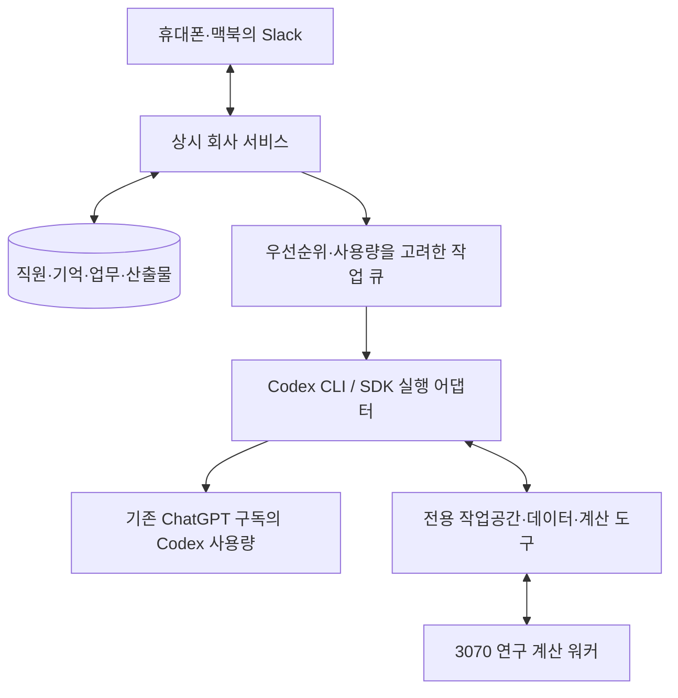

# 기존 Codex Pro 20x 구독을 활용하는 운영안

- 작성: 2026-09-16
- 배경: 사용자가 이미 Codex 20x를 구독하고 있어 추가 API 비용을 줄이는 방법을 요청했다.
- 상태: 공식 구독 실행 어댑터 구현. 실제 로컬 Codex 모델 응답과 같은 요청의 저장 결과 재사용을 검증했다. 실제 Slack·원격 배포·서버 인증은 미실행.
- 현재 동작과 증거: [Codex 실행기](../../../services/quant-company/docs/codex-runtime.md), [구현 검증 기록](IMPLEMENTATION-VALIDATION.json).
- 기존 비교안: [API 기반 비용 추정](COST-ESTIMATE.md), [회사 아키텍처](ARCHITECTURE.md)

## 1. 권장 방향

초기 운영은 **기존 Codex 구독으로 연구·개발·분석을 수행하고, 별도 상시 서버가 직원·업무·기억·Slack을 관리하는 방식**을 우선 검토한다.
LLM 실행 어댑터를 바꾸어도 국내·글로벌·가상자산 연구팀과 금융전략 BOT의 책임·자료·기억은 유지한다.

구독은 Codex의 공식 로그인과 실행 도구를 통해 사용한다. OpenAI Responses API나 Anthropic API 요금에
구독 크레딧을 대신 적용하는 구조가 아니다. 초기 API 자동 대체와 유료 크레딧 자동 구매는 사용하지 않는 안이다.

## 2. 확인한 공식 기능

| 항목 | 확인 내용 |
|---|---|
| 구독 인증 | Codex CLI는 ChatGPT 로그인으로 구독 이용 가능 |
| 자동 실행 | `codex exec`는 예약 작업·파이프라인에 사용할 수 있고 저장된 CLI 인증을 재사용 |
| 구조화 출력 | JSONL 이벤트와 최종 응답 schema 지원 |
| 세션 연결 | CLI/SDK에서 직원별 thread를 시작·재개할 수 있음 |
| 원격 서버 로그인 | 브라우저가 없는 서버에서 device-code 로그인 경로 제공 |
| 공식 Slack 연동 | 구독과 연결한 cloud 환경에서 `@Codex`에게 작업 요청 가능 |
| 사용량 | 로컬·cloud 작업이 구독 한도를 공유하며 주간 제한도 적용될 수 있음 |

[Codex 인증](https://learn.chatgpt.com/docs/auth),
[자동 실행](https://learn.chatgpt.com/docs/non-interactive-mode),
[SDK](https://learn.chatgpt.com/docs/codex-sdk),
[Slack 연동](https://learn.chatgpt.com/docs/third-party/slack),
[구독과 사용량](https://learn.chatgpt.com/docs/pricing)

공식 문서는 자동화의 기본값으로 API key를 권장하지만, 구독 한도로 실행해야 하는 경우를 위한
ChatGPT-managed 인증 유지 경로도 설명한다. 본인 전용의 신뢰하는 서버·비공개 작업 환경으로 구성하고,
인증 갱신·보관은 Codex의 공식 경로를 사용한다.
[계정 인증을 유지하는 자동화](https://learn.chatgpt.com/docs/auth/ci-cd-auth)

## 3. 회사 구조에 연결하는 방법

- 서버에 Codex를 설치하고 사용자가 해당 서버에서 자신의 계정으로 공식 로그인한다.
- 직원마다 직무·도구·전문 기억과 프로젝트별 thread ID를 둔다.
- 대화·업무 소유권·결정·후속 약속은 회사 DB에 보관한다. Codex의 세션 파일만을 회사 기억으로 삼지 않는다.
- Slack 요청 또는 예약 업무가 오면 필요한 직원의 Codex 작업을 실행한다.
- 직원이 반환한 동료 요청·산출물·다음 행동을 회사 서비스가 검증·기록·전달한다.
- 장시간 계산은 외부 작업 ID를 반환하는 도구로 제출하고 후속 이벤트에서 결과를 회수한다.
- 맥북은 로그인 후 상시 실행에 필요하지 않다. 회사 서비스와 Codex 실행기는 별도 서버에서 계속 가동한다.

초기에는 `codex exec --json` 또는 버전을 고정한 공식 SDK를 실행 어댑터로 사용한다.
새 지시는 작업 revision으로 기록하고, 안전한 경계에서 작업 중단·재개 또는 다음 turn 입력으로 반영한다.
CLI만 연결했다고 진행 중인 모든 작업의 즉시 방향 전환까지 구현된 것은 아니다.

App Server에는 깊은 대화 통합·사용량 조회 기능이 있다. 다만 현재 공식 문서는 app-server 명령과
원격 WebSocket 경로를 실험적·운영 미지원으로 명시한다. 공개 WebSocket을 회사의 필수 경로로 삼지 않고,
필요한 기능은 로컬 전송·고정 버전에서 검증한 뒤 채택한다.
[App Server](https://learn.chatgpt.com/docs/app-server)

공식 Slack 앱은 빠르게 Codex 작업을 맡기는 출발점이다. 직원 10명의 고유 계정·직접 위임·공용 지식과
자동 후속 업무를 연결하려면 별도의 회사 서비스가 필요하다.

## 4. 모델과 직원 구성

2026-09-16 로컬 Codex 0.154.0에서 모델 turn 없이 조회한 결과:

- 인증 방식: `chatgpt`, 계정 plan type: `pro`.
- 제공 모델: GPT-6 Astra, GPT-5.6 Sol, GPT-5.6 Terra, GPT-5.6 Luna, GPT-5.5.
- 사용자에게서 받은 구독 정보는 20x다. 로컬의 `pro` 값만으로 5x/20x를 별도 판별한 것은 아니다.
- 실제 모델 실행·Slack 연결·원격 로그인·재시작 인수는 아직 미실행이다.

초기 배치는 총괄·금융 종합의 어려운 안건에 Astra, 연구·개발에 Sol, 일반 자료 작업에 Terra,
분류·라우팅·짧은 정리에 Luna다. 직무별 시험으로 품질과 구독 소모량을 확인한다.

독립 검증은 구현과 분리한 Codex thread·증거·권한으로 시작할 수 있다.
Claude와 같은 다른 공급자의 모델을 추가하면 별도 비용이 발생하며, 공급자 다양성 확보는 추가 옵션으로 남긴다.

## 5. 사용량 관리

직원 10명은 하나의 개인 구독 사용량을 나눠 쓴다. 현재 사용자가 직접 수행하는 Codex 업무도 같은 계정 한도에 영향을 준다.
20x는 고정된 월 API 토큰이나 금액으로 환산하지 않는다. 모델·문맥·도구·추론·실행 위치에 따라 소모가 달라진다.

운영 정책 제안:

1. 사용자의 직접 지시와 현재 대화에 우선순위를 준다.
2. 초기 자동 작업 동시 실행은 1개부터 시작하고, 사용량·응답 시간을 확인해 늘린다.
3. 직원들은 모두 등록된 상태로 유지하되 작업이 생겼을 때 실행한다. 서로 계속 대답하는 무한 대화는 만들지 않는다.
4. 남은 한도가 적으면 자동 조사·추가 실험을 대기시킨다. 단순 상태 조회는 모델 호출 없이 처리한다.
5. quota 제한과 일시적인 네트워크 오류를 구별한다. 한도 오류를 짧은 간격으로 재시도하지 않는다.
6. 한도 reset 뒤 대기 작업의 현재 지시·필요성을 확인하고 재개한다.
7. 봇 수만큼 별도 사용량이 생기는 것으로 계산하지 않는다. 자동 계정 순환은 사용하지 않는다.
   사용자가 등록한 기본·예비 프로필 중 회사 공용 계정을 명시적으로 선택할 수 있다.
   [소유자 수동 전환](../runbooks/model-accounts.md)은 각 계정의 한도와 불확실한 요청 기록을 보존한다.
8. 남아 있는 유료 크레딧의 자동 소모 여부도 운영 전에 확인한다. API fallback·추가 구매는 별도 결정이다.

현재 읽기 전용 조회에서는 기본 Codex 주간 사용량 항목이 이미 많이 사용된 상태였다.
다른 limit bucket도 반환되므로 기본 항목 하나만으로 모든 모델의 여유를 단정할 수는 없다.
실제 자동 업무 가능량은 본인의 기존 사용량을 포함해 관찰해야 한다.

상시 서비스 가동과 LLM 사용량은 별개다. 한도 소진 중에도 업무 접수·상태·기억은 유지하지만,
새 추론 작업의 즉시 처리는 한도 회복 또는 별도 유료 경로가 필요할 수 있다.

## 6. 추가 비용

기존 구독료를 이미 지불한다는 조건의 **추가 운영비**다. 같은 API 견적의 처리량을 보장하는 비교가 아니다.
예산 환율 1 USD = 1,500원, 세금·해외 결제 수수료·유료 데이터·실거래 인프라는 제외한다.

| 구성 | 추가 월 예산 | 포함 범위 |
|---|---:|---|
| 최소 비용 시작 | 약 4~6만원 | 저가 8GB VPS 1대에 서비스·DB 통합, 외부 백업·작은 업무 실행 사용량, Slack Pro 사용자 1명. 해당 저가 상품 공급 확인 필요 |
| AWS 단일 서버 시작 | 약 6~8만원 | Lightsail 4GB 1대, DB 통합·백업·작은 업무 실행 사용량, Slack Pro 사용자 1명 |
| 서버·DB 이중화 운영 | 약 30~55만원 | 인스턴스 2개, 관리형 DB·백업·관찰·영속 업무, Slack |
| Codex 추론 | 포함 한도 안에서는 추가 토큰별 API 비용 없음 | 기존 구독료는 계속 발생. 한도 초과 크레딧·API 비용은 제외 |

단가·사용량 가정·공급 제한은 [서버 최소 비용안](MINIMUM-SERVER.md)에 기록했다.
앞서 제안한 소규모 10~25만원보다 서비스와 DB를 한 서버에 모은 예산이다. 실제 자원 크기는 실행
어댑터·동시 작업·문서량의 부하를 확인해 정한다. 단일 서버 장애 시 복구 중단이 있으며 자동 이중화는 없다.

## 7. 첫 검증

- 원격 전용 서버에서 공식 구독 로그인과 단일 Codex 작업 수행.
- 금융전략→연구→데이터의 독립 thread와 회사 메시지 전달.
- 사용자 중간 지시·프로세스 재시작 후 업무 재개.
- 한도 부족·인증 만료 상황에서 유료 경로로 자동 전환하지 않고 대기.
- 본인 직접 사용과 함께 운영하며 일별 구독 소모·대기·작업 품질 측정.

위 검증을 마친 후 처리량이 부족한 직무에만 제한된 API 예산을 추가하는 순서가 적절하다.
