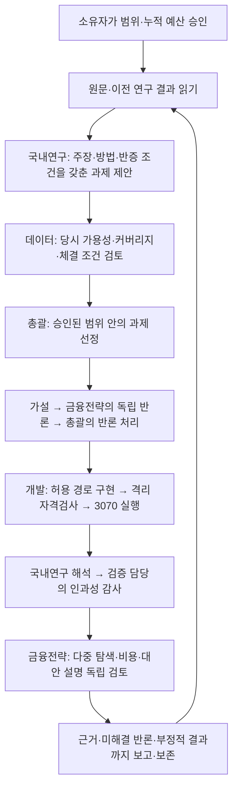

# 자료 기반 자율 연구 프로그램 — 구현·검증

기준: 2026-09-28. 코드: `efd2e50cfb34758a894c8a735b9319dc488cd18d`.
기능 구현과 격리 환경 검증을 완료했다. 운영 활성화·실제 연구 인수는 아래 준비 조건을
충족한 뒤 진행한다. 과학 실험·실제 시장 성과·새 기능의 Slack 전달을 완료했다고 주장하지 않는다.

## 구현한 업무 흐름

- 프로그램에는 시장별 코드·입력 SHA·평가기·비용·개발/봉인 기간과 유한한 시행·계산시간·과제 한도가 있다.
  같은 승인을 상속한 자식 과제만 실행하며, 모델 출력으로 승인할 수 없다.
- 원문 위치와 실제 인용문을 대조하고, 직원의 현재 시도에서 끝까지 읽은 영수증을 확인한다.
  수정·철회된 원문은 보존하되 새 과제·실행의 근거로 사용하지 못한다.
- 모든 반론에 수정·시험·기각 사유를 남긴다. 남겨둔 시험은 독립 결과 검토에서 산출물 경로나
  미해결 상태를 기록해야 한다. 미해결 반론이 있으면 가설 지지를 선언할 수 없다.
- 과학 시행과 계산시간은 PostgreSQL에서 실행 전에 원자적으로 예약한다. 기술 실패는 시간만
  정산하고, 실행 여부가 불명확한 작업은 영수증을 확인할 때까지 예약을 유지한다.
- 부정적 결과와 결론 보류도 후속 과제의 출처가 된다. 동점이면 이전 최선 후보를 보존한다.
  최선의 개발구간 후보라는 기록은 채택·확증 통과를 뜻하지 않는다.
- 선택적인 `RESEARCH_LIBRARY_CHANNEL_ID`는 검증한 보고서를 허용된 채널의 기존 outbox에 넣는다.
  미설정이면 기존 연구 스레드와 출처 저장소를 사용한다.

## 검증 범위와 증거

전체 검사의 최종 집계는 [validation.json](evidence/research-programs-20260928/validation.json)에 기록한다.
기존 전체 회귀검사와 수정 뒤의 새 통합검사를 구분하고, 중복 검사 수를 합산하지 않는다.

| 대상 | 실제로 확인한 내용 | 구분 |
|---|---|---|
| PostgreSQL | 실제 일회용 DB, migration, 소유자 승인, 병렬 예약 경쟁, 원문 읽기, 반론 처리, 보고서 게시 | 실제 PG; 사용자·직원 응답은 fixture |
| Temporal | 새 프로그램의 원문 읽기 후 worker 재시작, 세 직원 단계 완료, 이력 replay | 실제 Temporal; 모델은 fixture |
| 감사·보고 | 서로 다른 두 합성 실험 → 실제 고정 qlab 영수증 검증 → 별도 해석 → 보고서 원본·라이브러리 outbox | 실제 검증기; 감사 의견·산출물은 fixture |
| 3070 | 주식/ETF × 전략/주장/재현 6개 경우, 두 sandbox 단계 및 엄격한 결과 소비 | 실제 Linux·RTX 3070·bubblewrap; 입력은 합성 |
| 인과성 경계 | D-1 정보, 늦은 공개, 다음 시가, 여러 시점 절단·미래 교란, 거래 불가·보유 가격 결손 거절 | 작은 합성 guard; 경제적 타당성 판정 아님 |
| 배포 준비 | 회사 Git bundle과 정확한 commit, import preflight, 워커 코드/설정 쌍 생성 | 새 경로에 준비; 활성화 안 함 |
| 실제 구독 모델·Slack·시장 자료 | 이번 기능의 최종 운영 인수 | 미실행 |

[3070 여섯 영수증](evidence/research-programs-20260928/domestic-linux.json)에는
`fixture_only=true`, `scientific_trials_added=0`, `real_snapshot_reads=0`을 기록했다.
[워커 준비 영수증](evidence/research-programs-20260928/worker-preparation.json)은
운영 commit `31ff903f08a1471d26cb2ce0fef9643a0b34fc75`와 설정 해시가 유지됨을 확인한다.
진행 중인 운영 job의 최종 상태나 서버 배포 상태를 이번 준비 영수증에서 추정하지 않는다.

## 실행 가능한 연구 범위

새 전송 계약은 `kr-research-python-v2`다. `kr-etf-research-v2`와 `kr-stock-research-v2`는
독립된 실행 프로필과 입력 식별자를 갖는다. 직원이 수정할 수 있는 기본 경로는
`labs/company-domestic-research/candidate.py`, `config.json`이다.

전략은 D-1까지 공개된 정보로 다음 시가에 장기 보유 비중을 정하는 long-only 무차입 평가다.
수정 시가의 가격 수익률에 회전 비용을 적용한다. 거래정지·상장폐지 정산 자료가 없는
보유 경로는 거절하며, 현금 배당을 포함한 총수익을 주장하지 않는다.

주장/재현 평가의 첫 구현은 예측 점수와 다음 시가 수익률의 횡단면 상관이다. 달력 월별
평균이 30개 이상이어야 하며, 고정된 95% 정규 근사 구간을 사용한다. 다른 추정량의 논문은
별도 보호 평가기가 필요하다. 원문과 시장·기간·데이터·방법이 다르면 시장 전이 연구로 기록한다.
다중 가설 탐색을 보정한 확증 검정을 제공한다고 해석해서는 안 된다.

후보 callback에는 과거 정보만 주지만, 임의 후보 코드가 읽기 전용 입력 파일 자체에 접근하는
것까지 이 API가 증명하거나 차단하지는 않는다. 파일 직접 접근, 학습 범위, 라벨 만기,
정규화와 모델 선택은 실행 후보별 인과성 감사에서 확인해야 한다.

## 운영 반영을 위한 구체적 다음 단계

1. [첫 프로그램 준비안](FIRST-RESEARCH-PROGRAM-20260928.md)의 실제 원문·시장별 PIT 입력·기준값을
   확인하고, 준비 도구로 서버/워커 프로필과 해시를 만든다. 기존 레이크나 연구 저장소를 변경하지 않는다.
2. [운영 절차](../runbooks/research-programs.md)에 따라 현재 서버 release·기존 job·백업을 다시 확인한다.
   준비된 워커 릴리스는 기존 ETF 프로필만 보존했다. 새 시장 프로필이 등록된 배포 묶음은 아직 없다.
3. 정확한 배포 묶음과 완전한 프로그램 JSON을 검토한 뒤 배포 및 소유자 프로그램 승인을 받는다.
   이는 승인된 작업 계약의 명시적 결정 단계다. 현재 준비안은 실행 가능한 승인 명세가 아니다.
4. 승인 후 실제 직원·자료로 ETF/주식 각각 서로 다른 실험, 반론에 따른 후속 선택, 독립 검증,
   보고서 원본 및 실제 Slack 수신을 인수한다. 유망한 후보가 없어도 근거 있는 부정적 결과로 완료한다.

설계: [ADR 0037](../adr/0037-literature-grounded-research-programs.md).
