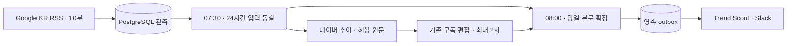

# 한국 검색 트렌드 아침 브리핑

한국의 사회·경제·기술·문화·연예·스포츠·소비 주제를 전용 `#search-trends` 채널에
매일 **08:00 KST, 최대 8개** 전달한다. 발송 전용 **Trend Scout** 앱과 기존 회사의
PostgreSQL·Temporal·Codex 구독을 사용한다. 설치 기본값은 수집·발송 모두 꺼짐이다.
구현과 실제 운영 검증 범위는 [검증 기록](project/TREND-FEED-VALIDATION.md)에 구분한다.

## 자료와 편집

| 자료 | 용도 | 해석 |
|---|---|---|
| Google Trends 한국 RSS | 24시간 수집, 급상승 주제 발견 | RSS에 관측된 관심 주제이며 전체 검색량 순위가 아님 |
| NAVER API HUB 검색어 트렌드 | 후보별 최근 28일 추이 | 한 응답 안에서 최근 7일/이전 7일 평균 비교 |
| Google 관련 기사·NAVER 뉴스 검색 | 관련 기사 발견 | 검색 결과 제목은 배경 설명의 근거로 사용하지 않음 |
| 기존 허용 언론사 원문 | 짧은 배경과 출처 | 원문 수집 성공·날짜·권한을 확인한 기사만 사용 |

Google 피드를 10분 대기 간격으로 수집한다. 장애에는 최대 1시간까지 간격을 늘린다.
07:30에 직전 24시간의 **관측 시각**을 기준으로 입력을 동결하고, 정규화한 키워드별
Google 규모 표시의 최대값·최근 관측 시각·제목 순으로 상위 20개 후보를 정한다.
반복 관측한 숫자를 합산하지 않는다. `처음 포착`은 이 서비스에서 처음 관측했다는 뜻이다.
첫날에는 이력 부족, 집계 구간에 30분을 넘는 수집 공백이 있으면 공백을 표시한다.

네이버 조회는 전날까지 28일, 최대 5개 키워드씩 요청한다. 응답의 마지막 실제 날짜를
표시하고, 연속 14일이 없거나 이전 7일 평균이 0이면 비교 불가로 남긴다.
정규화된 다른 응답의 지수를 이어 붙이거나 키워드 간 검색량으로 비교하지 않는다.
Google과 네이버를 더한 점수·전체 플랫폼 순위도 만들지 않는다.

원문은 기존 `news_sources_file`의 활성화된 요약 허용 언론사만 읽는다.
주제별 최대 2건, 본문 최대 1,200자를 편집 입력으로 사용한다. 기사 날짜는 마감 기준
48시간 이내여야 한다. 원문을 확인하지 못하면 해당 주제는 제목·관련 링크만 제공한다.
네이버 검색 결과로 원문 허용 목록을 우회하지 않는다. 허용 원문 범위에 따라 연예·스포츠
등의 배경 설명이 제한될 수 있지만 키워드 자체를 경제 주제로 필터링하지 않는다.

기존 Reporter에 설정된 모델·reasoning effort로 한 번 편집한다. 완료된 제안이 계약 검증에
실패한 경우에만 한 번 더 요청한다. 기능 전체에서 KST 하루 최대 2개 모델 요청이며 회사
공통 호출 예산과 뉴스 모델 실행 경로를 공유한다. 추가 유료 AI API로 전환하지 않는다.
모델은 `AgentDecision.artifacts` 안의 `TrendBriefDraft`만 반환한다. 모든 후보를 한 번씩
포함하고, 합치기는 공통 원문 근거가 있을 때만 허용한다. 원문에 없는 인용, 외부 링크,
메시지·도구·위임·기억 제안은 거부한다. 표시 숫자와 링크는 서버가 만든다.
인용 검증은 의미 전체의 독립 사실 검증을 보장하지 않는다.

## 시간과 복구



08시 확정 작업은 수집·AI 편집과 독립된 Temporal 작업이다. 자료 보강이나 AI가 늦으면
숫자·링크 중심으로 확정한다. 실제 Slack 도착은 인프라·Slack 상태에 따라 지연될 수 있다.
날짜·한국·채널로 고정한 ID에 최종 본문과 outbox를 한 DB 트랜잭션으로 커밋한다.
늦은 모델 응답이 최종 본문을 바꾸거나 두 번째 브리핑을 만들지 않는다.
08~09시 재시작은 당일분만 따라잡고, 09시 이후는 만료된다. 전날 미발송분을 몰아서 보내지 않는다.

발송 직전에도 채널·사용자 허용 목록·정책·만료를 다시 검사한다. 회사 전체 일시 중지는
편집·발송에 적용된다. HTTP 429는 같은 발송 ID로 기다리지만 타임아웃·서버 5xx·성공 응답의
채널 또는 `ts` 누락·전송 중 종료는 `uncertain`으로 보존한다. 운영자가 실제 Slack과 영수증을
대조하며 자동 재발송하지 않는다. 정확히 한 번 전달을 보장하지 않는다.
불명 모델 호출도 새로운 요청으로 자동 대체하지 않는다. 확실한 quota/busy는 같은 ID로 대기한다.

사용한 스냅샷·원문 발췌·모델 응답·최종 본문·발송 영수증은 DB에 남는다. 일반 RSS 스냅샷은
90일 후 정리하되 동결한 브리핑이 참조하는 스냅샷은 유지한다. 키워드 최초 관측 이력도 보존한다.
네이버 요청은 재시도를 포함해 KST 하루 100회 이하로 제한하고 동결 입력별 응답을 캐시한다.

## 설치

1. [Trend Scout manifest](../slack-apps/trend_scout.json)로 앱을 설치하고 `#search-trends`에 초대한다.
   `chat:write`만 필요하다. 이벤트·Socket Mode·App-Level Token·signing secret은 사용하지 않는다.
   현재 생성된 앱은 `A0C7VRH8JV6`, 채널은 `C0C6WTA9ECV`이며
   [현재 연결 상태](project/TREND-FEED-VALIDATION.md)를 확인해 기존 것을 사용한다.
2. 기존 서버 Slack 비밀 저장소에 `trend_scout`의 `app_id`, `bot_user_id`, `bot_token`을 추가한다.
   토큰을 코드·채팅·모델 실행기로 복사하지 않는다. 기존 직원 항목을 덮어쓰지 않는다.
3. 실제 채널·소유자를 회사 허용 목록에 추가한다. 다음 환경을 모든 회사 프로세스에 동일하게 적용한다.
   기존 뉴스·기술·퀀트 등 피드 채널과 같은 채널을 지정하면 동작하지 않는다.

```dotenv
TREND_FEED_ENABLED=true
TREND_FEED_PUBLISH_ENABLED=false
TREND_FEED_CHANNEL_ID=C_ACTUAL_SEARCH_TRENDS_ID
TREND_FEED_OWNER_USER=U_ACTUAL_OWNER_ID
TREND_FEED_NAVER_ENABLED=true
```

별도 `ROLES_FILE`을 사용한다면 패키지의 `trend_scout` 항목도 반영한다. `active=false`,
`model=unused`, 빈 도구·위임 권한을 유지하며 Reporter 모델 설정은 기존 값을 사용한다.

네이버 API HUB에서 검색어 트렌드와 뉴스 검색을 활성화한 애플리케이션의 키를
서버의 `STATE_DIR/secrets/trend-naver-credentials.json`에 저장한다. 형식은
[키 파일 예시](../deploy/trend-naver-credentials.example.json)를 따른다.
[추가 Compose 파일](../deploy/trend-feed.compose.yaml)을 기본 Compose에 함께 적용하면
`news-worker`에만 읽기 전용 secret으로 연결된다. Codex 컨테이너에는 연결하지 않는다.
로컬 실행은 `TREND_FEED_NAVER_CREDENTIALS_FILE`로 서버 프로세스의 파일 경로를 지정한다.
키가 없거나 비활성화되면 Google 자료는 계속 처리하고 네이버 추이는 확인 불가로 표시한다.

```bash
uv sync --frozen
uv run --frozen quant-company migrate
uv run --frozen quant-company trend-feed probe --output .local/trend-feed-probe.json
uv run --frozen quant-company trend-feed collect
uv run --frozen quant-company trend-feed preview
uv run --frozen quant-company trend-feed status
```

`probe`는 실제 Google RSS와 네이버 키 파일의 설정 여부만 검사한다. 네이버 인증 성공을
뜻하지 않으며 DB·모델·Slack에 연결하지 않는다. `collect`는 DB에 수집하고 해당 시간에는
네이버·원문 보강도 수행한다. CLI `preview`는 저장 자료만 렌더링하며 AI·Slack을 호출하지 않는다.
**상시 미리보기 모드**는 예정된 AI 편집을 수행하되 outbox를 만들지 않는 모드다.
`status`는 수집 성공/실패, 네이버 요청 수, 모델 상태, 당일 브리핑과 발송 영수증 상태를 보여준다.

상시 실행은 기존 `news-worker`·`dispatch`·Slack 발송 프로세스를 사용한다. 별도 cron은 없다.
수집/확정 workflow ID는 `company-trend-feed-collection-v1` / `company-trend-feed-digest-v1`이며
회사 큐의 `-trend-collection`에서 실행한다. 편집 ID는 `company-trend-feed-editorial-v1`이며
기존 `-news-model` 큐에서 실행한다. 새 런타임은 이 세 workflow를 함께 등록한다.

3일간 미리보기에서 관측 누락·후보 품질·08시 확정·원문 제한을 확인하고, 실제 Codex 실행과
전용 Slack 앱의 실제 채널 발송 영수증을 확인한 후 `TREND_FEED_PUBLISH_ENABLED=true`로 전환한다.
이미 확정한 미리보기는 활성화해도 재발송하지 않으므로 전환 후 다음 날부터 수신한다.
비활성화는 `TREND_FEED_ENABLED=false`와 `TREND_FEED_PUBLISH_ENABLED=false`를 적용한다.

## 검증 명령과 외부 계약

```bash
uv run --frozen pytest -q tests/test_trend_feed.py tests/test_trend_feed_temporal.py
uv run --frozen ruff check .
uv run --frozen python scripts/qualify_trend_feed.py --live --output .local/trend-feed-live.json
```

자동 검사는 실제 임시 PostgreSQL과 로컬 Temporal을 사용하지만 HTTP 자료·모델·Slack은 모의다.
마지막 opt-in 명령은 실제 공개 자료와 기존 공식 Codex 인증으로 최대 2회 실행하며, 기능 시계를
다음 날 아침으로 옮긴 임시 DB를 사용한다. 네이버·Slack에 연결하지 않고 3일 관측을 대신하지 않는다.
전역 CLI와 서비스의 고정 버전이 다르면 `--codex-bin /absolute/path/to/pinned/codex`를 지정한다.
`uv run --frozen`은 독립 worktree에서 선택적 형제 `quant-data` 저장소를 요구하지 않도록 한다.

외부 계약 확인일: 2026-10-06.
[Google Trends 도움말](https://support.google.com/trends/answer/3076011?hl=ko),
[한국 RSS](https://trends.google.com/trending/rss?geo=KR),
[NAVER 검색어 트렌드 API](https://api.ncloud-docs.com/docs/naver-api-hub-search-trend),
[NAVER 뉴스 검색 API](https://api.ncloud-docs.com/docs/naver-api-hub-search-news)를 사용한다.
API HUB의 `POST /search-trend/v1/search`, `GET /search/v1/news`와
`X-NCP-APIGW-API-KEY-ID` / `X-NCP-APIGW-API-KEY` 헤더를 사용한다.
추가 유료 API로 자동 전환하지 않는다. 현재 API HUB는
[한시적 무료 안내](https://guide.ncloud-docs.com/docs/apihub-spec)가 있으므로 상시 무료로 가정하지 않는다.
